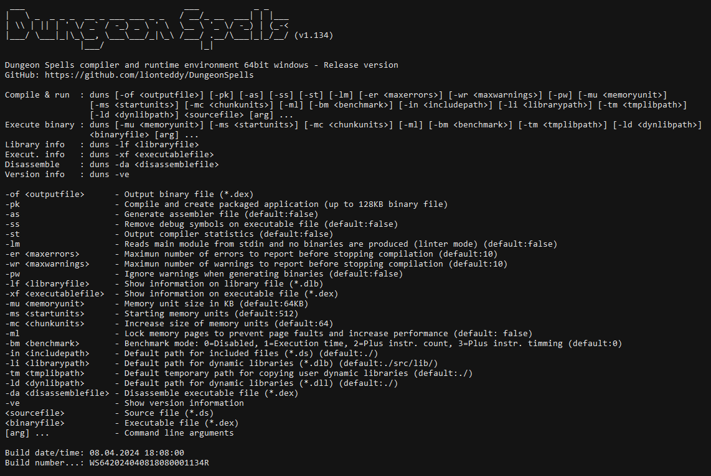

# Dungeon Spells

**Dungeon Spells compiler and runtime environment**



## What is it?

Dungeon Spells is a strongly an statically typed, object oriented and structured programming language. It is targeted to run in compiled form against its virtual machine. 
It is developed in c++ (uses g++). The core language features are as follows:

- Integer data types (char (8bit), short (16bit), int (32bit) and long (64bit) signed integer types)
- Double floating point types
- Strings (limited only by available memory)
- Standard set of C operators
- Arrays (up to 5 dimensions, dynamically resizeable and fixed size ones)
- Object oriented programming (Classes with private/public fields and member functions)
- Pass arguments to functions by reference or by value without explicitly using pointers
- Function call overload
- Operator overload
- Nested function and class definitions
- Modularized source files
- Can compile source into library that can be staticaly linked into other sources
- 32bit and 64bit compilation modes
- Multiplatform oriented (at this moment targeting Linux and Windows)
- Compiled code runs against a virtual machine optimized for speed and performance

There are features that are left out on purpose due to the inherent inestability that they introduce:

- Unsigned integer types: mixing signed and unsigned integer types in expressions yield to computationally correct but mathematically absurd results. 
Language is more robust and less error prone using signed integers only.
- Pointers: the language does not include pointers on purpose for simplicity and stability reasons. The scenarios on which pointers are mandatory, 
like passing arguments to functions by reference, are handled automatically by compiler. The need of pointers is not justified due to the potential big inestability 
that they add to the final application. This language is designed to be flexible but robust.

## Source code structure

In order to start coding we need to know that source files are structured into sections to ease readability of the code and to keep things tidy. The source code contains up to five sections:

- Option section: Here we provide options for the compiler or the runtime environment.
- Library section: We specify on this section static libraries used in our program or another modules to include.
- Public section: Declaration of public objects go here. All that is declared in this section will be visible to other modules.
- Private section: Declaration of private objects go here. Objects declared here are module-scoped, they are not visible outside the current module.
- Implementation section: Definition of all the functions goes here. All functions must be previously declared in order to be defined. 
There is only one function that must not be declared: The main function which is the program entry point, it does not have any arguments and returns nothing.

Source code sections are all optional except for the implementation section wich is mandatory, 
because there is one function in the code t0hat must be present which is the entry point (main:).
The order in which sections must appear in the code is like shown above and cannot be changed.

This a sample source with all sections declared:

```
//Option section
set init_vars=true

//Libraries and modules
.libs
  import standard as std
  include othermodule as mod

//Public section
.public
  int i=5
  string text="Hello"

//Private section
.private
  int j=2
  string str="world!"

//Implementation section
.implem

//Program entry point
main:
  std.print(text + "," + str + (i+j).tostr())
:main
```

This sample program will display on the screen the string "Hello,world!7"

## Notation conventions

As language syntax is explained through this guide, please take into account the following conventions:

- Identifiers: Variable names, function names, etc., will be noted between less and greater characters: &lt;identifier&gt;
- Optional syntax: Tokens on a sentence that are optional are noted between bold brackets: **[** ... **]**, unless brackets are not bold which means that are part of syntax.
- Expressions: Places on a sentence in which an expression can be given, will be noted between less and greater characters with the word expression: &lt;expression&gt;
- Constant expressions: Expressions that need to be evaluated at compile time, will be noted between less and greater characters with the word constexpr: &lt;constexpr&gt;
- The sequence of characters (...), means a collection of sentences or code lines that are not relevant for the given example or explanation but that are present

## Source code lines, join and split

Source code lines end with carriage return by default, there is not any line terminator character to be entered at end of the source code lines:

```
line1
line2
line3
```

In case it is necessary to place several sentences on one line they can be put toguether using semicolons (;):

```
line1; line2; line3
```

Also, in case it is necessary to write one sentence across several lines the sentence can be split using space + backslash at end of the lines:

```
this is one \
big sentence \
that is split \
across \
several lines
```

There is one exceptions to these rules: the sentences starting or ending by colon (:) (if, while, for, etc.) do not need to end in semicolon (;) when we combine them into one line:

```
if(i==0): x+=1; else: x+=2; :if
```

## Comments

The comments in the code have to be preceded by double slash (//):

```
//This is comment
```

They can at the beginning of the line or afterwards:

```
          //This is
          //also a
          //comment
```

The parser will ignore everything on the line after the double slash.

## Master data types

Master data types refers to all the possible data structures that are supported, from simple built-in types to classes, arrays, etc. These are the master data types defined:

|Master data type|Description                                                                                                                                             |
|----------------|--------------------------------------------------------------------------------------------------------------------------------------------------------|
|bool            |Booleans                                                                                                                                                |
|char            |8-bit signed integers                                                                                                                                   |
|short           |16-bit signed integers                                                                                                                                  |
|int             |32-bit signed integers                                                                                                                                  |
|long            |64-bit signed integers                                                                                                                                  |
|word            |Integer with variable bit width depending on platform (int on 32bit platforms,long on 64bit platforms)                                                  |
|float           |Double precision floating point numbers                                                                                                                 |
|string          |Arbitrary size character strings                                                                                                                        |
|enum            |Integers with closed set of domain values (very much like c enums)                                                                                      |
|class           |Structured object into fields (attributes) and function methods                                                                                         |
|fixed array     |Sequential list of objects (up to 5 dimensions). Are declared with with dimension sizes and cannot be resized afterwards. Number of dimensions is fixed.|
|dynamic array   |Sequential list of objects (up to 5 dimensions). Are declared without dimension sizes, size can be changed dynamically, but not number of dimensions.   |

All objects, depending on its master type have a set of available built-in methods. These are called master methods (see chapter [Master Methods](#master-methods))

Master types bool,char,short,int,long,word,float & string are also referred in documentation as master atomic data types (since they are not intended to be subdivided into smaller parts).

## Litteral values

When in the source code we must provide litteral values, there are options that we have:

### Booleans

Boolean litterals refer to the boolean values true and false. On the code they are expressed with the keywords "true" and "false".

### Integers

Integer litterals are 8-bit to 64-bit signed integer values. Depending on the numeric value they are assigned the following master types:

|Type |Size     |Numeric range                                                                                       |
|-----|---------|----------------------------------------------------------------------------------------------------|
|char |8-bit    |-127 to +127                                                                                        |
|short|16-bit   |-32,767 to +32,767                                                                                  |
|int  |32-bit   |-2,147,483,647 to +2,147,483,647                                                                    |
|long |64-bit   |-9,223,372,036,854,775,807 to +9,223,372,036,854,775,807                                            |
|word |32/64 bit|same as int in 32-bit or same as long in 64-bit mode (see [32/64 bit versions](#32-64-bit-versions))|

Integer litterals are expressed in decimal base by default, however it is possible to write them in octal and hexadecimal bases by using corresponding prefixes:

- Octal litterals (using "0c" prefix), example: 0c1234
- Hexadecimal litterals (using "0x" prefix), example: 0xABCD

When it is necessary to exactly specify the data type of the integer litteral we can use appropriate suffixes:

- char litteral (using "R" suffix), example: 90R
- short litteral (using "S" suffix), example: 524S
- int litteral (using "N" suffix), example: 51234N
- long litteral (using "L" suffix), example: 9467123034L

If suffix is not given to the litteral the compiler uses the minimun size data type that can accomodate the number (1 becomes char, 200 becomes short, etc.)

### Floating point numbers

Floating point litterals are numbers writen with decimal places or in scientific notation (*base* E *exponent*), valid floating point numbers are for example:

- 0.123
- 123.456
- 1E5
- 123E45
- -123E-45

Internally, they are stored using double precision floating point format according to IEEE-754 binary 64-bit format (technically speaking, as compiler is implemented in C++, 
floating point arithmetics uses C++ "double" types which are implemented using IEEE-754 64-bit format).

### Chars

Chars are 8-bit integers are explained before, we can write char litteral values using numbers or using single character strings delimited with single quotes ('):

- 'a', becomes 97
- '0', becomes 48
- 'X', becomes 88

There are several allowed escape sequences when writting char litterals this way:

|Sequence|Value                             |
|--------|----------------------------------|
|\a      |0x07 (Audible bell)               |
|\b      |0x08 (Backspace)                  |
|\f      |0x0C (Form feed)                  |
|\n      |0x0A (Line feed)                  |
|\r      |0x0D (Carriage return)            |
|\t      |0x09 (Horizontal tab)             |
|\v      |0x0B (Vertical tab)               |
|\'      |0x27 (Single quote)               |
|\\      |0x5C (Backslash)                  |
|\xNN    |0xNN (Arbitrary hexadecimal value)|

### Strings

Strings are arbitrary size character sequences. There is a limit on the size of the string litterals which is 2\*10^9 characters, 
however the string type itself when referred to variables does not have any imposed limit.
We can have an expression in the code to concatenate several string litterals to pass that limit, as string variables do not have any limit.

In the code string litterals are specified between double quotes ("):

```
"This is a string"
```

A long string can be written across several lines if we follow the rules given in [Source code lines, join and split](#source-code-lines-join-split), 
so that we must end string parts by space + backslash:

```
"This is a long  \
string litteral  \
across several  \
source code lines"
```

Example above is read as single string litteral by compiler as "This is a long string litteral across several source code lines".

String litterals also admit the same escape sequences as single string chars, but there is an extra escape sequence to escape the double quotes. 
They are escaped using two consecutive double quotes:

```
"This is a ""string"" with ""escaped"" double quotes"
```

### Raw strings

There is an alternative way to write string litterals in the code by using the so called raw string litterals. These are string litterals delimited between r"[ and ]", for example:

```
r"[This is a raw string litteral]"
```

The main difference with regular string litterals is that raw string litterals do not support any character escape sequences, 
everything between r"[ and ]" is part of the string litteral including carriage returns:

```
r"[This is a 
long raw string 
litteral across 
several lines 
of code]"
```

## Scopes

Every variable to be used in the code needs to have a declaration prior to the usage of the variable. 
Depending the block of the code the declaration happens variables are going to have any of the following scopes:

- Public: When variable is declared in module public scope (just after .public statement). 
This produces variable to be visible outside current module (see [Source code structure](#source-code-structure) and [Modules and libraries](#modules-and libraries)). 
Variables here are never deallocated and exist during entire program execution.
- Private: When variable is declared in module private scope (just after .private statement). 
This produces variable to be visible only inside current module (see [Source code structure](#source-code-structure) and [Modules and libraries](#modules-and libraries)). 
Like public variables, private variables are also not deallocated during entire program execution.
- Local: When variable is declared inside a function (regular functions, methods or operator overloads). 
This produces variable to be created when function is entered but destroyed when exited (see [Functions](#functions). Local variables are deallocated at function exit.
- Block: When variable is declared within code blocks (if,while,do,for,..), it is only is available inside that code block, 
although is not truly deallocated until function exit since it lives on the stack.

Since variables declared inside block scopes are not deallocated but only unreachable after scope end, it happens that a declaration of a variable with same name and type 
after scope is closed re-utilizes memory resources of the variable that previously existed. However, compiler treats this scenario as if it were a new and uninitialized variable.

Deallocation of memory resources is designed in the language to be fully automatic, developer does not have to worry about allocation and deallocation of memory resources. 
Variables can be used right after definition, for deallocation of memory compiler takes care. 

The language does not provide constructors and destructors of objects like other languages like c++, so these considerations about when variables are deallocated (destroyed) 
take less importance. They are important only to know what memory resources our program is consuming at a time.

In relation to data types they also belong to the scope on which its definition sentences are defined. The sentences that define types start with keywords: 
type, enum & class (see [Type definitions](#type-definitions), [Enums](#enums) and [Classes](#classes)). 
Also, declarations that contain array types (&lt;typename&gt;[...]) declare additional types as well (see [Arrays](#arrays)).

Data types can have these scopes:

- Public: When type is defined in module public scope (just after .public statement). 
This produces type to be visible outside current module (see [Source code structure](#source-code-structure) and [Modules and libraries](#modules-and libraries)).
- Private: When type is defined in module private scope (just after .private statement). 
This produces type to be visible only inside current module (see [Source code structure](#source-code-structure) and [Modules and libraries](#modules-and libraries)).
- Local: When type is defined inside a function (regular functions, methods or operator overloads). 
This produces type to exists only inside the function block (see [Functions](#functions).
- Class: Types can be defined inside a class definition, on these case the type definition is bound to the class definition and has same scope as container class.

## Identifiers

In the code we call identifier to the names we use for types, variables, class fields, functions, etc. All of them are called identifiers.

Identifiers must follow the following rules in order to be valid:

- They can only contain lower case letters (a-z), upper case letters (A-Z), numbers (0-9) and underscores (\_)
- They cannot start by a number (0-9)
- Maximun allowed length is 64 characters

## Variables

### Declaration

Variables are declared in the code in the following way:

&lt;typespec&gt; &lt;identifier&gt; **[**=&lt;expression&gt;**]**

You need to provide the name of the type of the variable, plus the variable name. Optionally an expression can be specified as variable initial value. See some examples:

```
bool var1   //This is a boolean variable
char var2   //This is a char variable
short var3  //This is a short variable
int var4    //This is a int variable
long var5   //This is a long variable
float var6  //This is a float variable
string var7 //This is a string variable

bool var8=false             //This is a boolean variable with initial value
char var9='a'               //This is a char variable with initial value
short var10=(512+64*2)      //This is a short variable with initial value
int var11=5000N             //This is a int variable with initial value
long var12=45L              //This is a long variable with initial value
float var13=3.14            //This is a float variable with initial value
string var14="Hello world!" //This is a string variable with initial value
```

Alternatively, a variable can be declared using the **var** keyword, and on this case the initial value expression is mandatory as data type for the variable is taken from it. 
Syntax is the following:

var &lt;identifier&gt; = &lt;expression&gt;

See some examples:

```
var var15=false          //This is a boolean variable
var var16='a'            //This is a char variable
var var17=(512+64*2)     //This is a short variable
var var18=5000N          //This is a int variable
var var19=45L            //This is a long variable
var var20=3.14           //This is a float variable
var var21="Hello world!" //This is a string variable
```

It is also possible to the typecast operator in order to force the value for a litteral expression, that would be the same for the variable:

```
var myvariable=(long)5000
```

The value **5000** is parsed as a 16-bit integer (short) but with the typecast ((long)) we force conversion to another data type, therefore above we declare a 64-bit variable.
See [Operators](#operators) to read more about operators in expressions.

### Constants

If the variable is going to have a constant value that cannot be modified it is necessary to add the keyword **const** before the declaration. 

Constants can be declared inside module public / private scopes and local scopes, but not inside block scopes (see [Scopes](#scopes)). 
The reason for this is that they are threated like global variables and are asigned only once during entire program execution, 
even if they are local and function in which they are declared is called many times. As memory resources for variables inside block scopes can be reallocated in subsequent blocks, 
this is incompatible with constants being assigned only once.

For constants the initial value expression is mandatory:

const &lt;typespec&gt; &lt;identifier&gt; = &lt;expression&gt;

See some examples:

```
const int iterations=5000N             //This is a int constant
const string salutation="Hello world!" //This is a float constant
```

### Static variables

Local scope variables can be declared as being static. These are variables that belong to module private scope but that are only visible within the function or method 
that contains the declaration.

As they are global variables they are not destroyed on function exit and its value is retained.

If they have an initial value expression, the asigment of the value happens only once, and this occurs along with other assignments for variables or constants in global scopes 
(public or private) that have initial value All these assigments happen before the program entry point is reached (*main:* statement).

The declaration is as follows

static &lt;typespec&gt; &lt;identifier&gt; **[**=&lt;expression&gt;**]**

These are examples of static variable declarations:

```
static int counter //This is a static int variable
static string text //This is a static string variable

static int items=5000N                 //This is a static int variable with initial value
static string hello_str="Hello world!" //This is a static string variable with initial value

```

A variable cannot be declared as being static and constant at the same time, this produces a syntax error.

### Default initialization

Variables can be declared with a default initial value if an asterisk is placed after the name, like this:

&lt;typespec&gt; &lt;identifier&gt;*

This will produce an assigment of a default value to the variable depending on its master type:

|Master type   |Default value                                                           |
|--------------|------------------------------------------------------------------------|
|bool          |false                                                                   |
|char          |0                                                                       |
|short         |0                                                                       |
|int           |0                                                                       |
|long          |0                                                                       |
|word          |0                                                                       |
|float         |0                                                                       |
|string        |empty string                                                            |
|enum          |0                                                                       |
|class         |All array elements initialized with default value as given in this table|
|fixed arrays  |All fields initialized with default value as given in this table        |
|dynamic arrays|empty array                                                             |

The default initialization is very useful to provide initial values to variables that have structured types (classes and arrays), since the expression to produce an initial value 
for these can be very long in the code depending on the comlexity of the data type.

The default initialization happens by default for all variables when no initial value is provided if the option *set init_vars=true* is provided at beginning of code 
(see [Default initialization option](#default-initialization-option).

## Arrays

Arrays are collection of elements of the same data type. It is possible to declare one dimension up to five dimension arrays. To declare an array variable the syntax is as follows:

&lt;typename&gt;[&lt;dimensions&gt;] &lt;identifier&gt; **[**=&lt;expression&gt;**]**

The part &lt;dimensions&gt; is the specification of the dimension sizes of the array. The sizes for the dimensions are given seprated by commas.
Here depending how dimensions are given we can have two different types of arrays, fixed size or dynamic size arrays.

### Fixed arrays

Are arrays with an explicit size given to the dimension sizes. For the dimension sizes we can use expressions, but it must use only litteral values and constant variables, 
so that it can be evaluated by compiler. On fixed arrays the size of the array is part of the data type itself. 

See some examples:

```
//One dimension array of strings with ten elements
string[10] sarray

//Two dimension array of floats with 25 by 5  elements
float[25,5] farray

//Three dimension array of chars with 100 by 10 by 40  elements
char[100,10,40] carray

```

In order to access the elements of the array we would place the index(-es) of the element inside brackets separated by commas, all indexes are zero-based:

```
//Access second element
sarray[1]="Hello"

//Access element at position 15,3
farray[15,3]=5.23

//Access element at position 50,5,25
carray[50,5,25]='a'

```

It is possible to provide an initial value for the array on its declaration this way:

```
//One dimension fixed array with initial value
int[5] iarray=(int[5]){1,2,3,4,5}

//Or using var keyword
var iarray=(int[5]){1,2,3,4,5}
```

### Dynamic arrays

On these arrays the explicit sizes of dimensions are not given, only the number of dimensions. 
For these arrays the size of the array is not part of the data type itself. See some examples:

```
//One dimension array of strings
string[] sarray

//Two dimension array of floats
float[,] farray

//Three dimension array of chars
char[,,] carray

```

In order to access the elements of the array we would place the index(-es) of the element inside brackets separated by commas, all indexes are zero-based. This is no difference with fixed arrays:

```
//Access second element
sarray[1]="Hello"

//Access element at position 15,3
farray[15,3]=5.23

//Access element at position 50,5,25
carray[50,5,25]='a'

```

The size of the dynamic arrays as its name indicates is not constant, can be set and modified at runtime during program execution as desired. There are several ways for this:
- We can set size of the dynamic array by using a expression on its declaration
- We can provide an initial value expression with var keyword
- We can use the method .rsize() that is defined for all dynamic arrays
- We can assign to the array another dynamic array
- We can assign to the array an expression that produces an array
- We can also do an empty initialization of the array, in this case dimension sizes are all zero

Let's see some examples:

```
//Use initial value expression on declaration to set array size
int[] myarray=(int[]){1,2,3}

//Use initial value expression with var keyword
var myarray=(int[]){1,2,3}

//Use the method .rsize() for one dimension array
char[] carray     //Declaration
carray.rsize(50)  //Set size of 50 elements

//Use the method .rsize() for two dimension array
string[,] sarray     //Declaration
sarray.rsize(10,10)  //Set size of 10 by 10 elements

//Assign to the array another dynamic array
float[,] farray1=(float[,]){{1,2,3},{4,5,6}}         //Variable farray1 has data type float[,] with size 2 x 3
float[,] farray2=(float[,]){{1,2,3},{4,5,6},{7,8,9}} //Variable farray2 has data type float[,] with size 3 x 3
float[,] farray3=farray1                             //Set size by assigning other array on declaration
farray3=farray2                                      //Set size by assigning other array on a sentence

//Assign to the array an expression that produces an array
string[] words="This is a string with spaces".split(" ")

//Do an empty initialization of the array
int[] myarray*

```

## Classes

We can define structured data types (classes) by using keywords class: and :class. The definition of scopes, fields, methods, etc. goes in between:

//Definition of class type  
class &lt;identifier&gt;:  
  
&nbsp;&nbsp;//Class definitions  
&nbsp;&nbsp;...  
  
:class

If in the code we would like to declare a variable using a class type we would use the name of the class as any other data type:

```
//Definition of class computer
class computer:
  int ram_gb
  int cpu_cores
  int storage_gb
:class

//Definition of variable *mycomputer* having *computer* data type:
computer mycomputer
```

Here an object referred through variable *mycomputer* exists from the very moment the variable is defined. There is not separated definition and instantiation. 

Memory resources are assigned to class variables (objects) right after definition. When the scope on which variable is declared is destroyed, corresponding variables are deallocated.
This is fully true only for local scopes. Module public / private scopes exist during entire program execution and are never deallocated until program exits. 
Definitions inside block and expression scopes are only unreachable outside these scopes but deallocated later at function exit. 
As constructors and destructors of objects are not available in the language, it is not important to know when objects are destroyed, 
this is something fully automatic and developer does not have to worry about it.

### Class scopes

Inside the class we can have definition of fields and methods are visible and adreasable outside the class (public members) and/or only inside the class (private members). 
In the class definition this controlled is by using the keywords .publ and .priv like this:

//Definition of class type  
class &lt;identifier&gt;:  
  
&nbsp;&nbsp;//Public definitions  
&nbsp;&nbsp;.publ  
&nbsp;&nbsp;...  
&nbsp;&nbsp;
&nbsp;&nbsp;//Private definitions  
&nbsp;&nbsp;.priv  
&nbsp;&nbsp;...  
  
:class

A class can be defined without any specification of the scopes. If this is the case everything inside the class is assumed to be **public**.

### Fields

In the classes the  data is structured using fields, fields are declared inside the class the very same way variables are declared:

&lt;typespec&gt; &lt;identifier&gt; **[**=&lt;expression&gt;**]**

Fields can be public or private depending on the scope they are declared (below .publ or below .priv statements respectively, or just all public no scope statements appear):

- Public fields: Are reachable outside the class methods (see [Access outside the class](#access-outside-the-class))
- Private fields: Are only reachable inside the class methods (see [Access inside the class](#access-inside-the-class))

See some examples:

```
class myclass:
  .publ
  string a //Public field
  .priv
  string b //Private field
:class
```

### Static fields

Fields can also be declared static:

static &lt;typespec&gt; &lt;identifier&gt; **[**=&lt;expression&gt;**]**

It means that this field will be shared for all instances of the class, so that the field has the same value on all class instances. 
Static fields ca have a default value, therefore we can assign it an expression after the declaration.

```
class myclass:
  .publ
  static string a=1 //Public static field
  .priv
  static string b=2 //Private static field
:class
```

### Methods and constructors

A class can have methods, which are functions that are defined linked to the definition of the class and that have access to all class fields regardless they are public or private.

Constructors are very much like methods, however they always has a return value an instance of the class and have a special syntax.

Below, go to [Functions](#functions) and [Class methods and constructors](#class-methods-and-constructors) in order to see syntax and have more details about methods and constructors.

### Nested class definitions

A classe can be defined inside another. See this example:

```
class myclass1:
  .publ
  int i
  class myclass2:
    .publ
    int i
    .priv
    string s
  :class
  myclass2 c
  .priv
  string s
  class myclass3:
    .publ
    int i
    .priv
    string s
  :class
  myclass3 d
:class
```

In that example the class myclass2 is defined in the public part of myclass1 and myclass3 on the private area. When classes are defined as nested, the corresponsing fields and data type names need to include the parent class:

```
//Variable declarations
myclass1 x
myclass1.myclass2 y
myclass1.myclass3 z

//Print all fields in class x
con.print(x.i.tostr())
con.print(x.c.i.tostr())
con.print(x.c.s)
con.print(x.s)
con.print(x.d.i.tostr())
con.print(x.d.s)

//Print all fields in class y
con.print(y.i.tostr())
con.print(y.s)

//Print all fields in class z
con.print(z.i.tostr())
con.print(z.s)

```

## Enums

The language supports enumerated types with the following syntax:

enum &lt;type_name&gt;:  
&nbsp;&nbsp;&lt;identifier1&gt; **[**=&lt;constexpr&gt;**]**  
&nbsp;&nbsp;&lt;identifier2&gt; **[**=&lt;constexpr&gt;**]**  
&nbsp;&nbsp;&lt;identifier3&gt; **[**=&lt;constexpr&gt;**]**  
&nbsp;&nbsp;...  
:enum

The constant expression next to the identifiers is optional, when it is present it is evaluated to calculate the value for the identifier. 
If it is not given, the identifier takes the value of the previous identifier plus one. When expression is not given for first identifier it is evaluated as zero.

Regardless of the data type of the constant expression when given its value is always casted to data type **int**, as well as enum fields without any value specification.

Let's see some examples:

```
enum colors1:
  red    //Evaluates to 0
  green  //Evaluates to 1
  blue   //Evaluates to 2
  yellow //Evaluates to 3
:enum

enum colors2:
  red    = 1 //Evaluates to 1
  green      //Evaluates to 2
  blue       //Evaluates to 3
  yellow     //Evaluates to 4
:enum

const int multiplier = 2
enum colors3:
  red          //Evaluates to 1
  green = 16*2 //Evaluates to 32
  blue         //Evaluates to 33
  yellow       //Evaluates to 34
:enum
```

In the code we can declare eumerated variables and assign them values like this:

```

//Declare enumerated type
enum colors:
  red
  green
  blue
  yellow
:enum

//Declare enumerated variable
colors col

//Assign an enumerated value
col=colors.green

//Use enumerared value in expression
if(col==colors.green):
  con.print("Color is green")
:if

```

## Type definitions

On the language we can define new data types from other data types:
- Built-in types: char, short, int, long, float, string
- Enums
- Classes
- Fixed or dynamic arrays of any of these
- Other type definitions

The syntax is the following:

type &lt;typespec&gt; as &lt;identifier&gt;

See some examples below:

```
//Type definitions from built-in types
type char as int8
type short as int16
type int as int32
type long as int64

//Type definition from an enum
enum colors:
  red
  green
  blue
:enum
type colors as rgb

//Type definition from a class
class myclass:
  float x;
  float y;
  float z;
:class
type myclass as point

//Type definition from arrays
type char[] as buffer
type float[3] as vector

//Type definition from another types
type char as int8
type int8 as byte

```

## Control flow statements

### If statements

The If statement allows to execute code conditionally based on a condition that is evaluated before. The syntax of If statement is as follows:

if(&lt;expression&gt;):  
&nbsp;&nbsp;//Statements to be executed  
&nbsp;&nbsp;(...)  
:endif

Therefore, the code between if(): and :endif keywords is executed only when &lt;expression&gt; evaluates to a boolean value true. If the &lt;expression&gt; does not evaluate to boolean compiler raises a syntax error.

If statement can have additional constructions. If there is code that has to be executed alternatively when the expression evaluates to false we can have this syntax using the else: keyword:

if(&lt;expression&gt;):  
&nbsp;&nbsp;//Statements to be executed when expression evaluates to true  
&nbsp;&nbsp;(...)  
else:  
&nbsp;&nbsp;//Statements to be executed when expression evaluates to false  
&nbsp;&nbsp;(...)  
:endif

We can also have multiple conditions, so only the code block that precedes the condition that evaluates to true is evaluated. We achieve this using elif(): keyword:

if(&lt;expression&gt;):  
&nbsp;&nbsp;//Statements to be executed when expression evaluates to true  
&nbsp;&nbsp;(...)  
elif(&lt;expression&gt;):  
&nbsp;&nbsp;//Statements to be executed when expression evaluates to true  
&nbsp;&nbsp;(...)  
elif(&lt;expression&gt;):  
&nbsp;&nbsp;//Statements to be executed when expression evaluates to true  
&nbsp;&nbsp;(...)  
elif(&lt;expression&gt;):  
&nbsp;&nbsp;//Statements to be executed when expression evaluates to true  
&nbsp;&nbsp;(...)  
:endif

If none of the expression evaluates to true the control flow is passed to the statement just after the :endif keyword. Also, when one of the expressions evaluates to true, the corresponding code block is executed then control flow jumps to sentence after :endif.

Finally, we can combine all together if():, elif(): and else:

if(&lt;expression&gt;):  
&nbsp;&nbsp;//Statements to be executed when expression evaluates to true  
&nbsp;&nbsp;(...)  
elif(&lt;expression&gt;):  
&nbsp;&nbsp;//Statements to be executed when expression evaluates to true  
&nbsp;&nbsp;(...)  
elif(&lt;expression&gt;):  
&nbsp;&nbsp;//Statements to be executed when expression evaluates to true  
&nbsp;&nbsp;(...)  
elif(&lt;expression&gt;):  
&nbsp;&nbsp;//Statements to be executed when expression evaluates to true  
&nbsp;&nbsp;(...)  
else:  
&nbsp;&nbsp;//Statements to be executed when all expressions evaluate to false  
&nbsp;&nbsp;(...)  
:endif

In this last case control flow executes always one code block in the if construction, since when all expressions evaluate to false, the code block after else: statement is executed.

Let's see some examples:

```
//Declarations
int i

(...)

//Single if statement
if(i==0):
  con.print("i is equal to 0")
:endif

//If else statement
if(i==0):
  con.print("i is equal to 0")
else:
  con.print("i is not 0")
:endif

//If elif statement
if(i==0):
  con.print("i is equal to 0")
elif(i==1):
  con.print("i is equal to 1")
elif(i==2):
  con.print("i is equal to 2")
elif(i==3):
  con.print("i is equal to 3")
:endif

//If elif else statement
if(i==0):
  con.print("i is equal to 0")
elif(i==1):
  con.print("i is equal to 1")
elif(i==2):
  con.print("i is equal to 2")
elif(i==3):
  con.print("i is equal to 3")
else:
  con.print("i is not 0,1,2 or 3")
:endif
```

### While loops

When it is necessary to execute code in a repetitive way checking a condition before each iteration we can use while loops. The syntax of the statement is as follows:

while(&lt;expression&gt;):  
&nbsp;&nbsp;//Statements to be executed  
&nbsp;&nbsp;(...)  
:while

Before entering the every iteration the expression is evaluated, if it evaluates to boolean false the execution flow jumps to the instructions after the :while keyword, if not, it enters into the loop once again.
The expression in the while(): statement must evaluate to boolean data type, otherwise a syntax error will happen.

Let's see an example:

```
int i=0
while(i<10):
  //Do some useful work here
  (...)
  i++
:while
```
On example above the statements inside the loop are executed 10 times.

### Do loops


When it is necessary to execute code in a repetitive way but checking a condition after each iteration we can use do loops. The syntax of the statement is as follows:

do:  
&nbsp;&nbsp;//Statements to be executed  
&nbsp;&nbsp;(...)  
:loop(&lt;expression&gt;)

After executing all statements inside the do: :loop() block and before jumping back to do: statement the expression is evaluated, if it evaluates to boolean false the execution flow jumps to the instructions after the :loop() keyword, if not, it jumps to do: statement and enters into the loop once again.
The expression in the :loop() statement must evaluate to boolean data type, otherwise a syntax error will happen.

Let's see an example:

```
int i=0
do:
  //Do some useful work here
  (...)
  i++
:loop(i<10)
```
On example above the statements inside the loop are executed 10 times.

### For loops

The language suports for loops, which are a more compact form of while loops. The syntax of the statement is as follows:

for(&lt;expression&gt; if &lt;expression&gt; do &lt;expression&gt;):  
&nbsp;&nbsp;//Statements to be executed  
&nbsp;&nbsp;(...)  
:for

On the for(): statement we have three expressions:
- Initialization expression (between beginning parenthesys and if keyword): It is executed only once before entering first iteration and before evaluating the loop condition expression.
- Loop condition expression (between if and do keywords): It is evaluated before entering inside the loop for every iteration, if it evaluates to boolean false the execution flow jumps to the instructions after the :for keyword, if not, it enters into the loop once again.
- Do expression (between do keyword and ending parenthesys): It is evaluated for every iteration after all statements in the loop are executed and just before the control jumps up from :for to for(): statement.
The loop condition expression must evaluate to boolean data type, otherwise a syntax error will happen. The other two expressions (initialization and do) can return any data type.

Let's see an example:

```
int i
for(i=0 if i<10 do i++):
  //Do some useful work here
  (...)
:for
```
On example above the statements inside the for loop are executed 10 times.

### Walk loops

There is a special statement to iterate over 1-dimensional arrays, which is a more compact and clear way to iterate over 1-dimensional arrays than any other of the loop constructions. The syntax of the statement is as follows:

walk(&lt;expression&gt; on &lt;identifier&gt; **[**index &lt;identifier&gt;**]** **[**if &lt;expression&gt;**]**):  
&nbsp;&nbsp;//Statements to be executed  
&nbsp;&nbsp;(...)  
:for

In the walk(): statement we have several parts:
- Array expression (between beginning parenthesys and on keyword): This expression is the array to be iterated, can be fixed or dynamic but must be 1-dimensional.
- On variable name (identifier after on keyword): It is an identifier that inside the walk loop corresponds to a local variable with the same data type as array expression elements. This identifier creates a variable (no prior declaration is necessary) that only exists within the walk(): :walk code block. It is destroyed after :walk statement. It holds the element of the array being iterated for each iteration.
- Index variable name (identifier after the inex keyword):  It is an identifier that inside the walk loop corresponds to a local variable with word data type (either 32-bit or 64-bit depending onarchitecture). This identifier creates a variable (no prior declaration is necessary) that only exists within the walk(): :walk code block. It is destroyed after :walk statement. It holds the index of the element being iterated for each iteration. Index part in walk() loops is optional.
- If expression (between if keyword and ending parenthesys): It is evaluated before entering a new iteration in the loop so that only array elements that meet this condition are iterated (condition must be true for elements iterated). It must be an expression that results in boolean data type. The if expression in walk() loops is optional.

Let's see some examples:

```
//1-dimensional array (can be fixed or dynamic)
var a=(int[]){1,2,3,4,5}

//Print all array elements
walk(a on n):
  con.println("element:"+n.tostr());
:walk

//Print all array elements along with index value
walk(a on n index i):
  con.println("element:"+n.tostr()+" index:"+i.tostr());
:walk

//Print all array elements greater or equal than 3
walk(a on n if n>=3):
  con.println("element:"+n.tostr());
:walk

//Print all array elements greater or equal than 3 along with index value
walk(a on n index i if n>0):
  con.println("element:"+n.tostr()+" index:"+i.tostr());
:walk

```

### Switch statement

The switch statement is a more compact way of expressing an if/elif/else construction. It has the following syntax:

switch(&lt;expression&gt;):  
&nbsp;&nbsp;when((&lt;expression&gt;):  
&nbsp;&nbsp;&nbsp;&nbsp;//Statements to be executed  
&nbsp;&nbsp;&nbsp;&nbsp;(...)  
&nbsp;&nbsp;&nbsp;&nbsp;break  
&nbsp;&nbsp;when((&lt;expression&gt;):  
&nbsp;&nbsp;&nbsp;&nbsp;//Statements to be executed  
&nbsp;&nbsp;&nbsp;&nbsp;(...)  
&nbsp;&nbsp;&nbsp;&nbsp;break  
&nbsp;&nbsp;when((&lt;expression&gt;):  
&nbsp;&nbsp;&nbsp;&nbsp;//Statements to be executed  
&nbsp;&nbsp;&nbsp;&nbsp;(...)  
&nbsp;&nbsp;&nbsp;&nbsp;break  
&nbsp;&nbsp;(...)  
&nbsp;&nbsp;default:  
&nbsp;&nbsp;&nbsp;&nbsp;//Statements to be executed  
&nbsp;&nbsp;&nbsp;&nbsp;(...)
:switch

The expression at the switch(): keyword is compared to the expressions in the when(): keywords using equality operator (==), one by one in sequential order. Then, when equality is true the corresponding code block between when(): and break statements is executed.
If there is notany true equality then the code after the default: keyword is executed. The default code block is optional, a switch statement can be constructed without it.
After the execution of the code for which there is an equality, of after the execution of the default block if present the break statement produces the control to jump right after the :switch keyword.

Let's see an example:

```
//Variable
string option=""

//A value for option is given elsewhere
(...)

//Check option value
switch(option):
  when("display"): 
    con.println("Selected option is display"); 
    break;
  when("execute"): 
    con.println("Selected option is execute"); 
    break;
  when("modify"): 
    con.println("Selected option is modify"); 
    break;
  default:
    con.println("Invalid option!"); 
    break;
:switch

```
### Break statement

The break statement alters the control flow inside loops by exiting the loop, no more iterations of the loop are done after break statement. The syntax is just the following:

break

A break sentence can happen in the following scenarios:
- Inside a while(): :while block: A break statement inside a while block produces the control to jump to the sentence right after the :while keyword.
- Inside a do: loop(): block: A break statement inside a do/loop block produces the control to jump to the sentence right after the :loop() keyword.
- Inside a for(): :for block: A break statement inside a for block produces the control to jump to the sentence right after the :for keyword.
- Inside a walk(): :walk block: A break statement inside a walk block produces the control to jump to the sentence right after the :walk keyword.
- Inside a when(): block: A break statement inside a when block inside the switch construction produces the control to jump to the sentence right after the :switch keyword. In fact, the break statement in whenor default blocks inside a switch block is optional. if a when block has no break, execution continues to the test the next when block or goes to default block if it is right after.

Let's see some examples:

```
//While with break sentence
int i=0
while(true):
  con.print(i.tostr())
  i++
  if(i>=10): 
    break
  :if
:while

//Do/loop with break sentence
int i=0
do:
  con.print(i.tostr())
  i++
  if(i>=10): 
    break
  :if
:loop(true)

//For with break sentence
for(int i=0 if i<50 do i++)
  con.print(i.tostr())
  if(i>=20): 
    break
  :if
:for

//Walk with break sentence
var a=(int[]){1,2,3,4,5}
walk(a on n index i):
  con.println("element:"+n.tostr());
  if(i>=3):
    break
  :if
:walk

//When blocks on switch without break
//Check option value
swich(option):
  when("display"): 
    con.println("Selected option is display")
    break
  when("execute"): 
  when("modify"): 
    con.println("Selected option is execute or modify")
    break
  default:
    con.println("Invalid option!")
    break
:switch
```

### Continue statement

The continue statements alters the control flow inside loops by jumping to the beginning of the loop, it terminates current iteration and starts the next one. The syntax is just the following:

continue

A continue sentence can happen in the following scenarios:
- Inside a while(): :while block: A continue statement inside a while block produces the control to jump to the while(): sentence, as it would do a new iteration.
- Inside a do: loop(): block: A continue statement inside a do/loop block produces the control to jump to the do: sentence starting new iteration.
- Inside a for(): :for block: A continue statement inside a for block produces the control to execute execute the do expression of the loop, then if condition of the loop is evaluated again as it would do a new iteration.
- Inside a walk(): :walk block: A continue statement inside a walk block produces the control to jump to the walk(): sentence to start a new iteration.

Let's see some examples:

```
//While with break sentence
int i=0
while(true):
  con.print(i.tostr())
  i++
  if(i<=10): 
    continue   
  else:
    break
  :if
:while

//Do/loop with break sentence
int i=0
do:
  con.print(i.tostr())
  i++
  if(i<=10): 
    continue
  else:
    break
  :if
:loop(true)

//For with break sentence
for(int i=0 if i<50 do i++)
  con.print(i.tostr())
  if(i<=20): 
    continue
  else:
    break
  :if
:for

//Walk with break sentence
var a=(int[]){1,2,3,4,5}
walk(a on n index i):
  con.println("element:"+n.tostr());
  if(i<=3)
    continue
  else:
    break
  :if
:walk
```

## Expressions

An expression is the combination of variables, litteral values, operators, parnthesys, function calls, etc. that is evaluated by compiler as a while to produce a single result.

The elements that can be combined inside an expression are the following ones:
- Operators (unary,binary and ternary)
- Variables
- Litteral values
- Complex litteral values (for classes and arrays)
- Parenthesis
- Subscripts
- Function and method calls
- for() expressions (a way to produce iterations inside an expression)
- Array generators (a way to generate an array from other array, as we would do with python list comprehension)

### L-values and R-values

The term l-value stands for left-value and similarly the term r-value stands for right-value. These two terms reffer directly to the properties of the left and right sides of an assignment operator, but these concepts apply to other operators as well.

The meaning of l-value and r-value for the compiler is the following:

- l-value is an expression that has an accesible and known memory address. Here, the properties accessible and known reffer from the source code perspective. If we go down to the machine level code everything has an accesible and known memory address, but from the source code perspective this does not happen always. An l-value expression reffers to a memory address that we can access an change (i.e.: we can assign a new value to it).
- r-value is an expression that does not have an accesible and known memory address, which means that we cannot reffer to that memory address within the source code to change the value. However, we can always get the value.

Note that by definition, an expression that is l-value is also r-value, but not the other way around.

For example these expressions reffer to an accesible and known memory address, they are l-values:  
- A variable name  
- An array or string expression with a subscript  
- A class expression plus member operator (.) plus a field name  
We could place any of these expressions on the left side of an assignment operator to access and change its value. We could also place an l-value expression on the right hand side of an assignmnt operator to get its value.


On the other hand, these expressions are r-values:  
- A litteral value  
- The addition of two variables or litteral values  
- The result of a function  
We only can only use them on the right hand side of an assignment operator to get the value, but we cannot change its value. From source code perspective, corresponding memory address is totally unaccessible and unknown.

The compiler knows the memory addresses that hold all of these values, however for r-values they are stored in hidden temporary variables that are created and destroyed autmatically by the compiler when expressions are evaluated. Its memory address is totally inaccessible for the developer and unknown.
These hidden temporary variables can be seen if we generate an assember file for our source code (-as command line option) or if we disassemble a binary file (-da command line option).

### Operators

#### Unary operators

- Postfix increment ++  
syntax: &lt;expression&gt; ++  
operands: Takes one single expression as operand that must be numeric (integer types or float) and l-value.  
result: Result is r-value and it is the value of operand before increasing it by one. After operation is completed, the operand itself is increased by one.

- Postfix decrement --  
syntax: &lt;expression&gt; --  
operands: Takes one single expression as operand that must be numeric (integer types or float) and l-value.  
result: Result is r-value and it is the value of operand before decreasing it by one. After operation is completed, the operand itself is decreased by one.

- Prefix increment ++  
syntax: ++ &lt;expression&gt; (or as an alternative way it also can be: (++) &lt;expression&gt; )  
operands: Takes one single expression as operand that must be numeric (integer types or float) and l-value.  
result: Result is l-value and it is the same input operand increased by one. 

- Prefix decrement --  
syntax: -- &lt;expression&gt; (or as an alternative way it also can be: (--) &lt;expression&gt; )  
operands: Takes one single expression as operand that must be numeric (integer types or float) and l-value.  
result: Result is l-value and it is the same input operand decreased by one. 

- Unary plus +  
syntax: + &lt;expression&gt; (or as an alternative way it also can be: (+) &lt;expression&gt; )  
operands: Takes one single expression as operand that must be numeric (integer types or float) and r-value.  
result: Result is r-value and it is the same input operand.

- Unary minus -  
syntax: - &lt;expression&gt; (or as an alternative way it also can be: (-) &lt;expression&gt; )  
operands: Takes one single expression as operand that must be numeric (integer types or float) and r-value.  
result: Result is r-value and it is the outcome of changing sign of operand.

- Logical NOT !  
syntax: ! &lt;expression&gt;  
operands: Takes one single expression as operand that must be boolean and r-value.  
result: Result is r-value and it is false when operand is true and vice versa.

- Bitwise NOT ~   
syntax: ~ &lt;expression&gt;  
operands: Takes one single expression as operand that must be numeric (integer types) and r-value.  
result: Result is r-value and it is bitwise not of operand (one's complement).

- Type cast operator  
syntax: (&lt;identifier&gt;) &lt;expression&gt;  
operands: Takes one single expression as operand that is r-value.  
result: Result is r-value and is the outcome of converting (casting) the input expression to the typename in parenthesys.  
The result depends on the master types of input expression (source) and casting data type (destination).
Tables below show all combinations that can happen:

&nbsp;&nbsp;&nbsp;&nbsp;&nbsp;&nbsp;&nbsp;&nbsp;When destination is master type bool:  

|                    |Destination bool
|--------------------|----------------
|source bool         |Type casting not necessary
|source char         |true if input is not zero else false
|source short        |true if input is not zero else false
|source int          |true if input is not zero else false
|source long         |true if input is not zero else false
|source word         |true if input is not zero else false
|source float        |true if input is not zero else false
|source string       |true if input is "1" or "true", false if input is "0" or "false", else exception
|source enum         |(not supported, syntax error)
|source class        |(not supported, syntax error)
|source fixed array  |(not supported, syntax error)
|source dynamic array|(not supported, syntax error)
  
&nbsp;&nbsp;&nbsp;&nbsp;&nbsp;&nbsp;&nbsp;&nbsp;When destination is master type char:   
  
|                    |Destination char
|--------------------|----------------
|source bool         |1 if input is true else zero
|source char         |Type casting not necessary
|source short        |Result is last 8 bits of input
|source int          |Result is last 8 bits of input
|source long         |Result is last 8 bits of input
|source word         |Result is last 8 bits of input
|source float        |If input is between -127 and +127, result is integer part of input, else exception
|source string       |Result if first character of input
|source enum         |(not supported, syntax error)
|source class        |(not supported, syntax error)
|source fixed array  |(not supported, syntax error)
|source dynamic array|(not supported, syntax error)
  
&nbsp;&nbsp;&nbsp;&nbsp;&nbsp;&nbsp;&nbsp;&nbsp;When destination is master type short:   
  
|                    |Destination short
|--------------------|----------------
|source bool         |1 if input is true else zero
|source char         |Result is input promoted to 16 bits
|source short        |Type casting not necessary
|source int          |Result is last 16 bits of input
|source long         |Result is last 16 bits of input
|source word         |Result is last 16 bits of input
|source float        |If input is between -(2^15 - 1) and +(2^15 - 1), result is integer part of input, else exception
|source string       |If input represents an integer number between -(2^15 - 1) and +(2^15 - 1), result is numeric value input, else exception
|source enum         |(not supported, syntax error)
|source class        |(not supported, syntax error)
|source fixed array  |(not supported, syntax error)
|source dynamic array|(not supported, syntax error)
  
&nbsp;&nbsp;&nbsp;&nbsp;&nbsp;&nbsp;&nbsp;&nbsp;When destination is master type int:   
  
|                    |Destination int
|--------------------|----------------
|source bool         |1 if input is true else zero
|source char         |Result is input promoted to 32 bits
|source short        |Result is input promoted to 32 bits
|source int          |Type casting not necessary
|source long         |Result is last 32 bits of input
|source word         |If architecture is 64 bit, result is last 32 bits of input else result is same as input
|source float        |If input is between -(2^31 - 1) and +(2^31 - 1), result is integer part of input, else exception
|source string       |If input represents an integer number between -(2^31 - 1) and +(2^31 - 1), result is numeric value input, else exception
|source enum         |Result is enumeration value (as internally they have int master type)
|source class        |(not supported, syntax error)
|source fixed array  |(not supported, syntax error)
|source dynamic array|(not supported, syntax error)
  
&nbsp;&nbsp;&nbsp;&nbsp;&nbsp;&nbsp;&nbsp;&nbsp;When destination is master type long:   
  
|                    |Destination long
|--------------------|----------------
|source bool         |1 if input is true else zero
|source char         |Result is input promoted to 64 bits
|source short        |Result is input promoted to 64 bits
|source int          |Result is input promoted to 64 bits
|source long         |Type casting not necessary
|source word         |If architecture is 64 bit, result is same as input else result is last 32 bits of input
|source float        |If input is between -(2^63 - 1) and +(2^63 - 1), result is integer part of input, else exception
|source string       |If input represents an integer number between -(2^63 - 1) and +(2^63 - 1), result is numeric value input, else exception
|source enum         |(not supported, syntax error)
|source class        |(not supported, syntax error)
|source fixed array  |(not supported, syntax error)
|source dynamic array|(not supported, syntax error)

&nbsp;&nbsp;&nbsp;&nbsp;&nbsp;&nbsp;&nbsp;&nbsp;When destination is master type word:   
  
|                    |Destination word
|--------------------|----------------
|source bool         |1 if input is true else zero
|source char         |If architecture is 64 bit, type cast to long occurs, else type cast to int occurs
|source short        |If architecture is 64 bit, type cast to long occurs, else type cast to int occurs
|source int          |If architecture is 64 bit, type cast to long occurs, else type cast to int occurs
|source long         |If architecture is 64 bit, type cast to long occurs, else type cast to int occurs
|source word         |If architecture is 64 bit, type cast to long occurs, else type cast to int occurs
|source float        |If architecture is 64 bit, type cast to long occurs, else type cast to int occurs
|source string       |If architecture is 64 bit, type cast to long occurs, else type cast to int occurs
|source enum         |(not supported, syntax error)
|source class        |(not supported, syntax error)
|source fixed array  |(not supported, syntax error)
|source dynamic array|(not supported, syntax error)
  
&nbsp;&nbsp;&nbsp;&nbsp;&nbsp;&nbsp;&nbsp;&nbsp;When destination is master type float:   
  
|                    |Destination float
|--------------------|----------------
|source bool         |1 if input is true else zero
|source char         |Result is input promoted to floating point
|source short        |Result is input promoted to floating point
|source int          |Result is input promoted to floating point
|source long         |Result is input promoted to floating point
|source word         |Result is input promoted to floating point
|source float        |Type casting not necessary
|source string       |If input represents a real number or a number in scientific notation, result is numeric value input, else exception
|source enum         |(not supported, syntax error)
|source class        |(not supported, syntax error)
|source fixed array  |(not supported, syntax error)
|source dynamic array|(not supported, syntax error)
  
&nbsp;&nbsp;&nbsp;&nbsp;&nbsp;&nbsp;&nbsp;&nbsp;When destination is master type string:   
  
|                    |Destination string
|--------------------|----------------
|source bool         |"true" if input is true else "false"
|source char         |Result a single char string
|source short        |Result is string that contains textual representation of numeric value
|source int          |Result is string that contains textual representation of numeric value
|source long         |Result is string that contains textual representation of numeric value
|source word         |Result is string that contains textual representation of numeric value
|source float        |Result is string that contains textual representation of numeric value
|source string       |Type casting not necessary
|source enum         |(not supported, syntax error)
|source class        |(not supported, syntax error)
|source fixed array  |(not supported, syntax error)
|source dynamic array|(not supported, syntax error)
  
&nbsp;&nbsp;&nbsp;&nbsp;&nbsp;&nbsp;&nbsp;&nbsp;When destination is master type enum:   
  
|                    |Destination enum
|--------------------|----------------
|source bool         |(not supported, syntax error)
|source char         |(not supported, syntax error)
|source short        |(not supported, syntax error)
|source int          |Result is copied from input (even if input is outside of enumerated values of destination data type)
|source long         |(not supported, syntax error)
|source word         |(not supported, syntax error)
|source float        |(not supported, syntax error)
|source string       |(not supported, syntax error)
|source enum         |(not supported, syntax error)
|source class        |(not supported, syntax error)
|source fixed array  |(not supported, syntax error)
|source dynamic array|(not supported, syntax error)

&nbsp;&nbsp;&nbsp;&nbsp;&nbsp;&nbsp;&nbsp;&nbsp;When destination is master type fixed arrray:   
  
|                    |Destination fixed array
|--------------------|----------------
|source bool         |(not supported syntax error)
|source char         |(not supported syntax error)
|source short        |(not supported syntax error)
|source int          |(not supported syntax error)
|source long         |(not supported syntax error)
|source word         |(not supported syntax error)
|source float        |(not supported syntax error)
|source string       |(not supported syntax error)
|source enum         |(not supported syntax error)
|source class        |(not supported syntax error)
|source fixed array  |If data type of array elements is the same, result is a fixed array with same dimensions and dimension sizes as destination. Array elements are copied from source to destination when indices match, else just filled with zeros.
|source dynamic array|If data type of array elements is the same, result is a fixed array with same dimensions and dimension sizes as destination. Array elements are copied from source to destination when indices match, else just filled with zeros.

&nbsp;&nbsp;&nbsp;&nbsp;&nbsp;&nbsp;&nbsp;&nbsp;When destination is master type dynamic array:   
  
|                    |Destination dynamic array
|--------------------|----------------
|source bool         |(not supported syntax error)
|source char         |(not supported syntax error)
|source short        |(not supported syntax error)
|source int          |(not supported syntax error)
|source long         |(not supported syntax error)
|source word         |(not supported syntax error)
|source float        |(not supported syntax error)
|source string       |(not supported syntax error)
|source enum         |(not supported syntax error)
|source class        |(not supported syntax error)
|source fixed array  |If data type of array elements is the same, result is a dynamic array with same dimensions and dimension sizes as destination. Array elements are copied from source to destination when indices match, else just filled with zeros.
|source dynamic array|If data type of array elements is the same, result is a dynamic array with same dimensions and dimension sizes as destination. Array elements are copied from source to destination when indices match, else just filled with zeros.

#### Binary operators

- Addition +  
syntax: &lt;expression&gt; + &lt;expression&gt;  
operands: Takes two expressions as operands (integer types, float or string) that are both r-values.  
result: Result is r-value it depends on data types of operands:  
&nbsp;- When two operands are integer types: The operand with shortest bit width is promoted to the bit with of largest operand, result has the bit width of largest operand and it is the addition of both operands.  
&nbsp;- When one of them is float and the other is integer (or both are float): The integer operand is promoted to float, then the result is float (or no conversion takes place if both are float already). Result is the addition of both operands.  
&nbsp;- When one operand is char and the other is string: The char operand is promoted to string, then the result is string and it is the concatenation of both operands.  
&nbsp;- When both operands are strings: Result is string and it is the concatenation of both operands.  

- Subtraction -  
syntax: &lt;expression&gt; - &lt;expression&gt;  
operands: Takes two expressions as operands (integer types or float) that are both r-values.  
result: Result is r-value it depends on data types of operands:  
&nbsp;- When two operands are integer types: The operand with shortest bit width is promoted to the bit with of largest operand, result has the bit width of largest operand and it is the substraction of both operands.  
&nbsp;- When one of them is float and the other is integer (or both are float): The integer operand is promoted to float, then the result is float (or no conversion takes place if both are float already). Result is the substraction of both operands.  

- Multiplication *  
syntax: &lt;expression&gt; * &lt;expression&gt;  
operands: Takes two expressions as operands (integer types or float) that are both r-values.  
result: Result is r-value it depends on data types of operands:  
&nbsp;- When two operands are integer types: The operand with shortest bit width is promoted to the bit with of largest operand, result has the bit width of largest operand and it is the multiplication of both operands.  
&nbsp;- When one of them is float and the other is integer (or both are float): The integer operand is promoted to float, then the result is float (or no conversion takes place if both are float already). Result is the multiplication of both operands.  

- Division /  
syntax: &lt;expression&gt; / &lt;expression&gt;  
operands: Takes two expressions as operands (integer types or float) that are both r-values.  
result: Result is r-value it depends on data types of operands:  
&nbsp;- When two operands are integer types: The operand with shortest bit width is promoted to the bit with of largest operand, result has the bit width of largest operand and it is the division of both operands.  
&nbsp;- When one of them is float and the other is integer (or both are float): The integer operand is promoted to float, then the result is float (or no conversion takes place if both are float already). Result is the division of both operands.  

- Modulus (remainder) %  
syntax: &lt;expression&gt; % &lt;expression&gt;  
operands: Takes two expressions as operands (integer types only) that are both r-values.  
result: Result is r-value. The operand with shortest bit width is promoted to the bit with of largest operand, result has the bit width of largest operand and it is the remainder of the division of both operands.  

- Equal to ==  
syntax: &lt;expression&gt; == &lt;expression&gt;  
operands: Takes two expressions as operands that are both r-values.  
result: Result is r-value and boolean. Depending on the types of input expressions the result is calculated as follows:  
&nbsp;- When two operands are booleans: They are compared, if they are both true or both false result is true, otherwise false.  
&nbsp;- When both are integers or floats: The operands are promoted to the same type, taking the one with highest bit width or float if one of them is float. Result is true if both operands hold the same value, otherwise false.  
&nbsp;- When both are strings: Result is true if both operands hold the same value, otherwise false.  
&nbsp;- When both are enums: Syntax error happens if operands do not have same enumerated type. Result is true if both operands hold the same value, otherwise false.  

- Not equal to !=  
syntax: &lt;expression&gt; != &lt;expression&gt;  
operands: Takes two expressions as operands that are both r-values.  
result: Result is r-value and boolean. Depending on the types of input expressions the result is calculated as follows:  
&nbsp;- When two operands are booleans: They are compared, Result is true if operands do not hold the same value, otherwise false.  
&nbsp;- When both are integers or floats: The operands are promoted to the same type, taking the one with highest bit width or float if one of them is float. Result is true if both operands do not hold the same value, otherwise false.  
&nbsp;- When both are strings: Result is true if both operands do not hold the same value, otherwise false.  
&nbsp;- When both are enums: Syntax error happens if operands do not have same enumerated type. Result is true if both operands do not hold the same value, otherwise false.  

- Less than <  
syntax: &lt;expression&gt; < &lt;expression&gt;  
operands: Takes two expressions as operands that are both r-values.  
result: Result is r-value and boolean. Depending on the types of input expressions the result is calculated as follows:  
&nbsp;- When both are integers or floats: The operands are promoted to the same type, taking the one with highest bit width or float if one of them is float. Result is true when left operand has a lower value than right operand, otherwise false.  
&nbsp;- When both are strings: Result is true if left string is lower than right string, otherwise false (internally strings are compared using C standard library strcmp()).  

- Greater than >  
syntax: &lt;expression&gt; > &lt;expression&gt;  
operands: Takes two expressions as operands that are both r-values.  
result: Result is r-value and boolean. Depending on the types of input expressions the result is calculated as follows:  
&nbsp;- When both are integers or floats: The operands are promoted to the same type, taking the one with highest bit width or float if one of them is float. Result is true when left operand has a higher value than right operand, otherwise false.  
&nbsp;- When both are strings: Result is true if left string is higher than right string, otherwise false (internally strings are compared using C standard library strcmp()).  

- Less than or equal to <=  
syntax: &lt;expression&gt; <= &lt;expression&gt;  
operands: Takes two expressions as operands that are both r-values.  
result: Result is r-value and boolean. Depending on the types of input expressions the result is calculated as follows:  
&nbsp;- When both are integers or floats: The operands are promoted to the same type, taking the one with highest bit width or float if one of them is float. Result is true when left operand has a lower value or is equal than right operand, otherwise false.  
&nbsp;- When both are strings: Result is true if left string is lower or is equal than right string, otherwise false (internally strings are compared using C standard library strcmp()).  

- Greater than or equal to >=  
syntax: &lt;expression&gt; >= &lt;expression&gt;  
operands: Takes two expressions as operands that are both r-values.  
result: Result is r-value and boolean. Depending on the types of input expressions the result is calculated as follows:  
&nbsp;- When both are integers or floats: The operands are promoted to the same type, taking the one with highest bit width or float if one of them is float. Result is true when left operand has a higher value or is equal than right operand, otherwise false.  
&nbsp;- When both are strings: Result is true if left string is higher or is equal than right string, otherwise false (internally strings are compared using C standard library strcmp()).

- Logical AND &&  
syntax: &lt;expression&gt; && &lt;expression&gt;  
operands: Takes two expressions as operands that are both r-values. Each of them must be boolean.  
result:  Result is r-value and boolean. It is true when left and right expressions are true,otherwise false.  

- Logical OR ||  
syntax: &lt;expression&gt; || &lt;expression&gt;  
operands: Takes two expressions as operands that are both r-values. Each of them must be boolean.  
result:  Result is r-value and boolean. It is true when any of left or right expressions is true, otherwise false.  

- Bitwise AND &  
syntax: &lt;expression&gt; & &lt;expression&gt;  
operands: Takes two expressions as operands that are both r-values. Each of them must be integer numeric of the same type.  
result: Result is r-value, has the same data type as input expressions and it is the result of AND operation at bit level of operands.  

- Bitwise XOR (exclusive or) ^  
syntax: &lt;expression&gt; ^ &lt;expression&gt;  
operands: Takes two expressions as operands that are both r-values. Each of them must be integer numeric of the same type.  
result: Result is r-value, has the same data type as input expressions and it is the result of XOR operation at bit level of operands.  

- Bitwise OR (inclusive or) |  
syntax: &lt;expression&gt; | &lt;expression&gt;  
operands: Takes two expressions as operands that are both r-values. Each of them must be integer numeric of the same type.  
result: Result is r-value, has the same data type as input expressions and it is the result of OR operation at bit level of operands.  

- Bitwise left shift <<  
syntax: &lt;expression&gt; << &lt;expression&gt;  
operands: Takes two expressions as operands that are both r-values. Each of them must be integer numeric.  
result: Result is r-value, has the same data type as left expression and it is the result of shiting bits to the left of the left expression the number of bits indicated by right expression.  

- Bitwise right shift >>  
syntax: &lt;expression&gt; >> &lt;expression&gt;  
operands: Takes two expressions as operands that are both r-values. Each of them must be integer numeric.  
result: Result is r-value, has the same data type as left expression and it is the result of shiting bits to the right of the left expression the number of bits indicated by right expression.  

- Assignment =  
syntax: &lt;expression&gt; = &lt;expression&gt;  
operands: Takes two expressions, left expression must be l-value and right is r-value.  
result: This operator copies the value of right expression into the left expression. Result is the left expression, which is also l-value. Depending on left expression data type we have the following cases:  
&nbsp;- When left is boolean data type: Right value is copied to the left and must be boolean as well.  
&nbsp;- When left is integer data type and right is integer with same bit width: Right value is copied to the left.  
&nbsp;- When left is integer data type and right is integer with smaller bit width: Right value is promoted to the same data type as left and it is copied to the left.  
&nbsp;- When left is integer data type and right is integer with bigger bit width: Syntax error happens as right value is not automatically promoted to the same data type as left (however typecast operator can e used).  
&nbsp;- When left is float data type and right is float as well: Right value is copied to the left.  
&nbsp;- When left is float data type and right is integer data type: Right value is promoted to float data type then copied to the left.  
&nbsp;- When left is string data type: Right value is copied to the left and must be string as well.  
&nbsp;- When left is enum data type: Right value is copied to the left and must be an enum of the same data type.  
&nbsp;- When left is class data type: Right value is copied to the left and must be a class object of the same data type.  
&nbsp;- When left is fixed array data type: Right value is copied to the left and must be a fixed array of same type, or a fixed array with same dimensions and sizes of same element data type (or even different if they are master atomic).  
&nbsp;- When left is dynamic array data type: Right value is copied to the left and must be a dynamic array of same type, or a dynamic array with same dimensions of same element data type (or even different if they are master atomic).  

- Assignment by sum +=  
syntax: &lt;expression&gt; += &lt;expression&gt;  
operands: Takes two expressions, left expression must be l-value and right is r-value.   
result: This operator does the addition of the two operands, then assigns the result to the first operand. Result is l-value and it depends on data type of left operand:  
&nbsp;- When left is integer data type: If right operand is also integer but with smaller bit width it is promoted to the right operand data type (if not syntax error happens). Then, operands are added and result is copied to the left operand.  
&nbsp;- When left is float data type: If right operand is integer it is promoted to float. Then, operands are added and result is copied to the left operand.  
&nbsp;- When left is string data type: Right operand must be also string. Operands are concatenated and result is copied to the left operand.  

- Assignment by difference -=  
syntax: &lt;expression&gt; -= &lt;expression&gt;  
operands: Takes two expressions, left expression must be l-value and right is r-value.   
result: This operator does the substraction of the two operands, then assigns the result to the first operand. Result is l-value and it depends on data type of left operand:  
&nbsp;- When left is integer data type: If right operand is also integer but with smaller bit width it is promoted to the right operand data type (if not syntax error happens). Then, operands are substracted and result is copied to the left operand.  
&nbsp;- When left is float data type: If right operand is integer it is promoted to float. Then, operands are subtracted and result is copied to the left operand.  

- Assignment by product *=  
syntax: &lt;expression&gt; *= &lt;expression&gt;  
operands: Takes two expressions, left expression must be l-value and right is r-value.   
result: This operator does the multiplication of the two operands, then assigns the result to the first operand. Result is l-value and it depends on data type of left operand:  
&nbsp;- When left is integer data type: If right operand is also integer but with smaller bit width it is promoted to the right operand data type (if not syntax error happens). Then, operands are multiplied and result is copied to the left operand.  
&nbsp;- When left is float data type: If right operand is integer it is promoted to float. Then, operands are multiplied and result is copied to the left operand.  

- Assignment by quotient /=  
syntax: &lt;expression&gt; /= &lt;expression&gt;  
operands: Takes two expressions, left expression must be l-value and right is r-value.   
result: This operator does the division of the two operands, then assigns the result to the first operand. Result is l-value and it depends on data type of left operand:  
&nbsp;- When left is integer data type: If right operand is also integer but with smaller bit width it is promoted to the right operand data type (if not syntax error happens). Then, operands are divided and result is copied to the left operand.  
&nbsp;- When left is float data type: If right operand is integer it is promoted to float. Then, operands are divided and result is copied to the left operand.  

- Assignment by remainder %=  
syntax: &lt;expression&gt; %= &lt;expression&gt;  
operands: Takes two expressions, left expression must be l-value and right is r-value.   
result: This operator does the remainder of the division of the two operands, then assigns the result to the first operand. Result is l-value. Both operands must be integers. If right operand has smaller bit width it is promoted to the right operand data type (if not syntax error happens). Then, remainder of the division of two operands is copied to the left operand.  

- Assignment by bitwise AND &=  
syntax: &lt;expression&gt; &= &lt;expression&gt;  
operands: Takes two expressions as operands, left expression must be l-value and right is r-value. Each of them must be integer numeric of the same type.  
result: This operator makes AND operation at bit level of two operands, then copies the result into the left operand. Result is l-value, has the same data type as input expressions.  

- Assignment by bitwise XOR ^=  
syntax: &lt;expression&gt; ^= &lt;expression&gt;  
operands: Takes two expressions as operands, left expression must be l-value and right is r-value. Each of them must be integer numeric of the same type.  
result: This operator makes XOR operation at bit level of two operands, then copies the result into the left operand. Result is l-value, has the same data type as input expressions.  

- Assignment by bitwise OR |=  
syntax: &lt;expression&gt; |= &lt;expression&gt;  
operands: Takes two expressions as operands, left expression must be l-value and right is r-value. Each of them must be integer numeric of the same type.  
result: This operator makes OR operation at bit level of two operands, then copies the result into the left operand. Result is l-value, has the same data type as input expressions.  

- Assignment by bitwise left shift <<=  
syntax: &lt;expression&gt; <<= &lt;expression&gt;  
operands: Takes two expressions as operands, left expression must be l-value and right is r-value. Each of them must be integer numeric.  
result: This operator shifts bits to the left of the left expression the number of bits indicated by right expression, then copies the result into the left operand. Result is l-value, has the same data type as left expression.  

- Assignment by bitwise right shift >>=  
syntax: &lt;expression&gt; >>= &lt;expression&gt;  
operands: Takes two expressions as operands, left expression must be l-value and right is r-value. Each of them must be integer numeric.  
result: This operator shifts bits to the right of the left expression the number of bits indicated by right expression, then copies the result into the left operand. Result is l-value, has the same data type as left expression.  

- Sequence operator ->  
syntax: &lt;expression&gt; -> &lt;expression&gt;  
operands: Takes two expressions of any data type, both are r-values.  
result: This operator evaluates left expression first, then right expression. Result is the right expression and has same data type as it.  

#### Ternary operator

The ternary operator is an inline-if construction that can be used within expressions. It has this syntax (parenthesys are mandatory):

( &lt;expression&gt; ? &lt;expression&gt; :  &lt;expression&gt; )

The first expression is evaluated, it must return boolean data type. Then if first expression is true, only second expression is evaluated and it is the result, if not only third expression is evaluated and it becomes the result as well. The three expressions on te ternary operator are all r-values.  

Let's see an example:

```
//Ternary operator
int i=0
int j=(i==0?1:2)
```

### Subscripts

Subscript is the syntax that is used to access the elements in arrays or the characters in strings. Therefore, subscriptable objects are fixed / dynamic arrays an strings. The syntax to place subsripts in expressions is the following:

&lt;expression&gt; [ &lt;expression&gt; ]

The first expression is the subscriptable object and the second one is another expression that must be integer that is called index. The valid numeric values for indexes are from zero to the last element of the subscriptable object minus one.

A subscript results in another expression that is l-value and that has the same data type of the element of the subscripted array or data type char for strings.

Let's see some examples:

```
//Fixed array subscript
var f=(int[3]){1,2,3}
con.print(f[0].tostr())
con.print(f[1].tostr())
con.print(f[2].tostr())

//Dynamic array subscript
var d=(int[]){1,2,3,4}
con.print(d[0].tostr())
con.print(d[1].tostr())
con.print(d[2].tostr())
con.print(d[3].tostr())

//String subscript
string s="Hello, this is a string"
con.print(s[0].tostr())
con.print(s[1].tostr())
con.print(s[2].tostr())
```

### Parenthesys

Parenthesys are used within expressions to indicate order of evaluation. What is inside a parenthesys is evaluated first. We can have in a expression as many parenthesys or parenthesys inside parenthesys as much as we want.

### Variable declarations inside expressions

Variable declarations can happen inside expressions. When a variable is declared like this it is only visible within the code block (if,while,do,for,..) the expression is located.

Let's see an example:
```
for(int i=0 if i<5 do i++):
  con.print(i.tostr())
:for
```

### Complex litteral values

A complex litteral value is a litteral value for a class or array variable, it consists of a collection of values that are organized depending on the data type. It has the following syntax:

( &lt;typespec&gt; ) { &lt;value&gt;,&lt;value&gt;,&lt;value&gt; ... }

This is an example of complex litteral value for a class:

```
//Class declaration
class myclass:
  int i
  float f
  string s
:class
...

//Variable declaration with initial value
myclass c=(myclass){1,3.5,"Hello"}
```

We can also have complex litteral values for arrays either fixed or dynamic:

```
//Print concatenated array elements
con.print((string[]){"This","is","a","string"}.join(" "))


//Set up multidimensional array using complex litteral value
var a=(string[,]){{"This","is"},{"a","string"}}
```

A complex litteral value can be used in all places on which we could use an r-value, in the example above we are using a complex litteral value to compose the argument for the print() argument.

Complex litteral values can also happen for any combination of arrays inside classes, classes with arrays as fields, multidimensional arrays or any combination of this style. See this example:

```
//Class declaration
class myclass1:
  int i
  float f
  string s
  class myclass2:
    int i
    float f
    string s
  :class
  int[] a
  myclass2 b
  myclass2[] c
:class
...

//Array of classes which a nested class and arrays inside
myclass1[] c=(myclass1[]){{1,2.5,"Hello",{3,4,5},{7,3.4,"world"},{{8,3.5,"Hello"},{9,6.2,"mars"}}},{2,1.5,"This",{5,6,7},{3,4.2,"complex"},{{10,4.5,"litteral"},{12,2.9,"value"}}}}
```

It is important to note that if we assign a complex litteral value to class variable, we will get a compiler error if not all class fields can be accessed from current scope (i.e.: class has private fields). In that case we need to define a class constructor or use allow statement (see [Class constructors](#class-constructors) and [Field1 and method access outside the class](#field-and-method-access-outside-the-class)).

### for() function

The for() function is a special construction of the language that allows to iterate and return a result within a expression. It has the following syntax:

for( &lt;expression&gt; if &lt;expression&gt; do &lt;expression&gt; return &lt;expression&gt; )

The four expressions that are between the parenthesys have this purpose (explained in the same order as in the syntax):
- Initialization expression: It is executed only once and at beginning
- If expression: It is executed at beginning of each iteration, it must return boolean. If true control jumps to do expression, if false to return expression
- Do expression: It is executed for each iteration when if expression is true
- Return expression: It is executed when if expression is false and it sets the return value of the for() function

Let's see some examples:
```
//This would initialize string variable mystring with "(aaaaa)"
string mystring="("+for(string s="" if s.len()<5 do s+="a" return s)+")"

//This would initialize array variable myarray as (char[]){'0','1','2','3','4','5','6','7','8','9'}
var myarray=for(char c=48->var a=(char[]){} if c<48+10 do a.add(c)->c++ return a)
```

### Array generators

The array() function is a way to dynamically generate a 1-dimension array within an expression using another 1-dimension array as basis. It has the following syntax: 

array( &lt;expression&gt; on &lt;identifier&gt; **[**index &lt;identifier&gt;**]** **[**if &lt;expression&gt;**]** as &lt;expression&gt; )

The purpose of expressions and identifiers that are betwen the parenthesys are the following (explained in the same order as in the syntax):
- Array expression: This is a 1-dimension array that will be used as basis, the array function would iterate over all elements in the array 
- On identifier: This is an identifier to hold the value of the elements of the basis array
- Index identifier: This is an identifier to hold the numeric index of the elements in the basis array (it is optional)
- If expression: This expression is a condition that must be met in order to iterate only over certain basis array elements (it is optional)
- As expression: This is an expression that would determine the values of the resulting array elements

Let's see some examples:
```
//This would calculate on array2 the square of the elements in array1, result is (int[]){0,1,4,9,16}
var array1=(int[]){0,1,2,3,4,5,6,7,8,9}
var array2=array(array1 on n index i if i<5 as n*n)

//This would calculate corresponding upper case strings for all elements in array1, result is (string[]){"HELLO","I","HAVE","A","DOG"}
var array1=(string[]){"hello","i","have","a","dog"}
var array2=array(array1 on n as n.upper())
```

### Evaluation priority

This is the evaluation priority for all operators and everything that can happen within an expression. The higher the priority the earlier it gets evaluated.

|Priority|Operator    |Description                                 |
|--------|------------|--------------------------------------------|
|14      |()          |Expression inside parenthesys               |
|14      |[]          |Subscripts                                  |
|14      |(?**:**)    |Ternary operator                            |
|14      |for()       |for() function                              |
|14      |array()     |Array generator                             |
|14      |func()      |Function calls                              |
|13      |++          |Postfix increment (returns original operand)|
|13      |--          |Postfix decrement (returns original operand)|
|12      |++          |Prefix increment (returns modified operand) |
|12      |--          |Prefix decrement (returns modified operand) |
|12      |+           |Unary plus                                  |
|12      |-           |Unary minus                                 |
|12      |!           |Logical NOT                                 |
|12      |~           |Bitwise NOT (One's Complement)              |
|12      |(type)      |Type cast operator                          |
|11      |*           |Multiplication                              |
|11      |/           |Division                                    |
|11      |%           |Modulo (remainder)                          |
|10      |+           |Addition                                    |
|10      |-           |Subtraction                                 |
|10      |<<          |Bitwise left shift                          |
|10      |>>          |Bitwise right shift                         |
| 9      |<           |Less than                                   |
| 9      |<=          |Less than or equal to                       |
| 9      |>           |Greater than                                |
| 9      |>=          |Greater than or equal to                    |
| 8      |==          |Equal to                                    |
| 8      |!=          |Not equal to                                |
| 7      |&           |Bitwise AND                                 |
| 6      |^           |Bitwise XOR (exclusive or)                  |
| 5      |&vert;      |Bitwise OR (inclusive or)                   |
| 4      |&&          |Logical AND                                 |
| 3      |&vert;&vert;|Logical OR                                  |
| 2      |=           |Initialization of declared variable         |
| 2      |=           |Direct assignment                           |
| 2      |+=          |Assignment by sum                           |
| 2      |-=          |Assignment by difference                    |
| 2      |*=          |Assignment by product                       |
| 2      |/=          |Assignment by quotient                      |
| 2      |%=          |Assignment by remainder                     |
| 2      |<<=         |Assignment by bitwise left shift            |
| 2      |>>=         |Assignment by bitwise right shift           |
| 2      |&=          |Assignment by bitwise AND                   |
| 2      |^=          |Assignment by bitwise XOR                   |
| 2      |&vert;=     |Assignment by bitwise OR                    |
| 1      |->          |Sequence operator (comma operator)          |

## Functions

Functions are supported in the language in several ways:
- Regular functions: They have module scope, and can be private to module or public (which is relevant when dealing with include files and libraries) (see [Regular functions](#regular-functions))
- class methods: They are defined inside a class and can have public or private scope within the class (see [Class methods and constructors](#class-methods-and-constructors))
- Operator overloads: They are special functions to enrich operators so they can compute with other times appart from the built-in types (see [Operator overload](#operator-overload))
- System calls: These are functions that are internally defined and implemented within the runtime, we must declare them in the code to be able to use them (see standard libraries) (see [System calls](#system-calls))
- System functions: These are functions that are translated by compiler into one single instruction call (without generating call overhead). We must pass the exact arguments for the instruction we want to call (see [System functions](#system-functions))
- Master methods: These are methods that are generically defined within the compiler for all master types (see [Master data types](#master-data-types) and [Master Methods](#master-methods)))
- Dll calls: These are functions that are declared in the code but implemented inside a dynamic linking library (.dll/.so) using c++ (see [Interface to C++ code](#interface-to-c++-code))

### Declaration

Declaration of all functions in the language is required, like in old-fashioned languages like C or C++. Being a C/C++ for many years makes to think of function declarations not as a disadvantage, but something that helps to understand the source code, specially when it gets bigger. Having a place in the source code in which you can see at a glance a summary of all your functions, increases a lot understanding of the code. That is why I have left in this language function declarations.

The generic way of declaring a function has the following syntax:

&lt;typespec&gt; &lt;identifier&gt; ( **[** &lt;arguments&gt; **[** )

The purpose of the elements in the syntax are these:
- &lt;typespec&gt;: This is the function returning data type, if we do not want to return anything we must use keyword **void**
- &lt;identifier&gt;: This is the function name. It must follow the same rules as identifiers for variables (see [Identifiers](#identifiers))
- &lt;arguments&gt;: This is the argument list specification, here we must specify as many arguments as sequired separated by comma. Argument list is optional.

### Arguments

In the argument list of the function declaration we must specify each argument this way:

**[**ref*]** &lt;typespec&gt; &lt;identifier&gt;

The meaning is the following:
- **[**ref*]**: This is an optional keyword, when used argument is passed by reference, which means that any changes that you make to the argument inside the function will be reflected when function returns. Argument is passed as a pointer in order to achieve this.
- &lt;typespec&gt;: This is the data type of the argument.
- &lt;identifier&gt;: This is the name of the argument.

We can pass any master type as argument or return any master type as function result. However, we must observe the following. The master types string, class, fixed and dynamic arrays are always passed to the function using pointers, to avoid copying into the stack large argument values. It is the effect as when we use *ref* keyword. The difference is the following:
- If we pass by reference (we use *ref* keyword) strings, classes, or arrays, the function receives a pointer that we can use to change referenced variable value.
- If we pass by value (we do not use *ref* keyword) strings, classes, or arrays, the function receives a pointer but is constant. We can access argument value, but not change it.

The compiler handles itself when to create of deferenciate pointers, ths is all automatic, you do not have to worry about it.

Inside functions we access the arguments as if they were local variables to the function by using the name of th argument, in fact, they have same behaviour.

### Return values

Also, in the function code we can use anytime the *return* statemnent to exit the function and return an expression to the caller. Syntax is the following:

return **[** &lt;expression&gt; **]**

Here, the expression is optional. Functions that do not return a value (declared as void), must use return statement without any expression.

### Regular functions

Regular functions are module scoped functions, they can be either public or private depending on the source section we place the declaration. The implementation section will define function itself. About program sections, we need to know:
- .public: If we place function declaration in module public section (after .public keyword), function can be called from inside and outside module
- .private: If we place function declaration in module private section (after .private keyword), function can be called only from inside module
- .implem: Either public or private, function definition is always in the implementation section.

The declaration of regular functions has this syntax:

&lt;typespec&gt; &lt;identifier&gt; ( **[** &lt;arguments&gt; **[** )

and implementation of the function has the following syntax:

func &lt;typespec&gt; &lt;identifier&gt; ( **[** &lt;arguments&gt; **[** ):

(...)

:func

The code that defines regular functions is enclosed between **func** and **:func** keywords.

Let's see an example:

```
//Library section
.libs
import console as con

//Public module section
.public
  int add(int a,int b)  //This is a public function declaration

//Private module section
.private
  int sub(int a,int b)  //This is a private function declaration

//Implementation section
.implem

//Definition of function add()
func int add(int a,int b):
  int result
  result=a+b
  return result
:func

//Definition of function sub()
func int sub(int a,int b):
  int result
  result=a-b
  return result
:func

//Program entry point, we will call both functions
main:
  con.println("add()"+add(1,2).tostr())
  con.println("sub()"+sub(1,2).tostr())
:main
```

### Class methods and constructors

Inside classes we can define methods and constructors:
- Methods: They are functions that can be called from any instance of the class they belong to and have access to all fields in the class either private or public.
- Constructors: They are functions that return an instance of the class, constructed from function arguments and defined code inside.

The language does not have automatic constructors/destructors that you can find in many languages (c++ for example). Allocation and deallocation of memory resources happens already, but it transparent to the user and cannot be altered.

#### Methods

Methods are declared inside the definition of classes with the very same syntax as declaration of regular functions:

&lt;typespec&gt; &lt;identifier&gt; ( **[** &lt;arguments&gt; **[** )

Depending on the zone of the class on which we declare the method we will have:
- Public methods: Declared after .publ statement. Can be called from inside and outside the class.
- Private methods: Declared after .priv statement. Can be called only from inside the class (another methods in the class).

The implementation of the class methods goes inside the program implementation section (after .implem statement) and has the following syntax:

fmem &lt;typespec&gt; &lt;identifier&gt;.&lt;identifier&gt; ( **[** &lt;arguments&gt; **[** ):

(...)

:fmem

The method name in this case is composed of two parts separated by member operator (.). The first part of name is the name of the class data type, the second one is the method function name itself.

The code that defines the method (also called within teh language as funtion members) is enclosed between **fmem** and **:fmem** keywords.

Let's see an example:

```
//Import libraries
.libs
import console as con

//Public definitions
.private

//Class definition
class myclass:
  
  //Public class zone
  .publ
  int a
  int increase_a(int x)
  void initvalues(int a,int b)
  
  //Private class zone
  .priv
  int b
  int increase_b(int y)

:class

//Implementation part
.implem

//Implementation of method myclass.initvalues()
fmem void myclass.initvalues(int a,int b):
  self.a=a
  self.b=b
:fmem

//Implementation of method myclass.increase_a()
fmem int myclass.increase_a(int x):
  self.a=selfa+x
  self.increase_b(x)
  return self.a
:fmem

//Implementation of method myclass.increase_b()
fmem int myclass.increase_b(int y):
  self.b=self.b+y
  return self.b
:fmem

//Progam entry point
main:
  myclass c
  c.initvalues(10,20)
  c.increase_a(5)
:main
```

Note that we do not call increase_b() method from main() since it is a private method, that can only be called from another method in the class, so it is called from increase_a().

The self keyword that appears in the example is the syntax that we need to follow access fields of current class instance within class methods (see [Field and method access inside the class](#field-and-method-access-inside-the-class))

#### Class constructors

Class constructors are function members with the special purpose of creating a class instance. They initialize class fields through the given argument list (if present) and return an instance of the class. Class constructor are declared inside the definition of classes like methods, with the following syntax:

&lt;class_name&gt; ( **[** &lt;arguments&gt; **[** )

The identifier must be the same class name they belong to. They do not have a returning data type on declaration, because they always return the same data type as the class they are defined inside.

Like class methods (see [Methods](#methods)) they can be public or private depending on the zone of the class on which they are declared, after .publ stament or after .priv statement.

The implementation of the class constructors goes inside the program implementation section (after .implem statement) and has the following syntax:

fmem &lt;class_name&gt; ( **[** &lt;arguments&gt; **[** ):

(...)

:fmem

The code that defines the class constructor is enclosed between **fmem** and **:fmem** keywords. These functions must return an instance of the class using **return self** statement.

The self keyword is used inside class methods (also constructors) is the way to access current class instance fields and methods (see [Field and method access inside the class](#field-and-method-access-inside-the-class)).

Let's see an example:

```
//Date class
class date:
  .publ
  date(int year,int month,int day)
  .priv
  int year
  int month
  int day
:class

.implem

//Implementation part
fmem date(int year,int month,int day):
  self.year=year
  self.month=month
  self.day=day
  return self
:fmem

//program entry point
main:
  date mydate
  mydate=date(1900,1,1)
:main
```

#### Initializer class methods

The compiler has built-in checks to avoid access to uninitialized variables. However, there is one scenario related to classes on which we cannot avoid accessing unitialized class instances.

Consider the following example:

```
class date:
  .publ
  void set_value(int year,int month,int day)
  .priv
  int year
  int month
  int day
:class

.implem

fmem date.set_value(int year,int month,int day):
  self.year=year
  self.month=month
  self.day=day
:fmem

main:
  date mydate
  mydate.set_value(1900,1,1) //<-- Compiler error!
:main
```

The highlighted line with comment "Compiler error!", will not compile since here the compiler would detect access to uninitialized class instance. The code tries to call a class methods before the class instance has any value. However, and here comes the inconsistency, the method .set_value() is intended to set a class value. 

To solve this situation the language provides a special keyword for class methods on which the compiler initialization check is skipped, since they are intended to set class value. Upon class method declaration we must use **init** keyword before returning data type specification, and that method would be able to be called even when class has not been initialized before.

The previous example with this correction is like this:

```
class date:
  .publ
  //Method declaration with init keyword before returning type spec
  init void set_value(int year,int month,int day)
  .priv
  int year
  int month
  int day
:class

.implem

fmem date.set_value(int year,int month,int day):
  self.year=year
  self.month=month
  self.day=day
:fmem

main:
  date mydate
  mydate.set_value(1900,1,1) //Now this line does not throw error
:main
```

#### Field and method access outside the class

The access of public fields and methods of a class instance outside the class definition is done using member operator (.), which is used after the class instance.

In this example we see how we can access the public fields and methods of a defined class:

```
class myclass:
  .publ
  init void set_values(int a,int b)
  int add()
  int sub()
  int a
  int b
:class

.implem

fmem myclass.set_values(int a,int b):
  self.a=a
  self.b=b
:fmem

fmem myclass.add():
  return self.a+self.b
:fmem

fmem myclass.sub():
  return self.a+self.b
:fmem

main:
  myclass c
  int result
  c.set_values(4,3)
  result=c.add()      //result is 7
  result=c.sub()      //result is 1
  c.a=5
  c.b=3
  result=c.add()      //result is 8
  result=c.sub()      //result is 2
:main
```

#### Field and method access inside the class

Inside th implementation of the class methods the language has a special mechanism to access the fields and methods of the current class instance through the **self** variable. We must use **self** variable and member operator (.) in order to access any of the fields and methods in the class.

```
class myclass:
  .publ
  int a
  int b
  int add()
  int square()
:class

.implem

fmem myclass.add():
  return self.a+self.b //Access to fields a and b using self variable
:fmem

fmem myclass.square():
  return self.add()*self.add() //Call add() twice to calculate (a+b)^2
:fmem
```

#### Private access overide

There is a special statement in the language to override class private access for fields and methods (this is the same idea as friend functions in c++). For example, if we need that a special function in our code (and only this function needs to have access to a private field in our class, we can allow this access from the class definition using **allow** statement. This statement goes inside the class definition private part and has the following syntax:

allow &lt;origin&gt; **[** to &lt;destination&gt; **]**

Depending on what is the origin and the destination we can have several cases:

|Origin           |Destination |Syntax                                                                                 |Description                                                                                                              |
|-----------------|------------|---------------------------------------------------------------------------------------|-------------------------------------------------------------------------------------------------------------------------|
|Class            |(omitted)   |allow &lt;foreign_class_name&gt;                                                       |Allows access from foreign class &lt;foreign_class_name&gt; to entire current class                                      |
|Class            |Class       |allow &lt;foreign_class_name&gt; to &lt;class_name&gt;                                 |Allows access from foreign class &lt;foreign_class_name&gt; to entire current class &lt;class_name&gt;                   |
|Class            |Class Field |allow &lt;foreign_class_name&gt; to &lt;field_name&gt;                                 |Allows access from foreign class &lt;foreign_class_name&gt; to current class field &lt;field_name&gt;                    |
|Class            |Class method|allow &lt;foreign_class_name&gt; to &lt;method_name&gt;()                              |Allows access from foreign class &lt;foreign_class_name&gt; to current class method &lt;method_name&gt;()                |
|Regular function |(omitted)   |allow &lt;foreign_function_name&gt;()                                                  |Allows access from foreign regular function &lt;foreign_function_name&gt;() to entire current class                      |
|Regular function |Class       |allow &lt;foreign_function_name&gt;() to &lt;class_name&gt;                            |Allows access from foreign regular function &lt;foreign_function_name&gt;() to entire current class &lt;class_name&gt;   |
|Regular function |Class Field |allow &lt;foreign_function_name&gt;() to &lt;field_name&gt;                            |Allows access from foreign regular function &lt;foreign_function_name&gt;() to current class field &lt;field_name&gt;    |
|Regular function |Class method|allow &lt;foreign_function_name&gt;() to &lt;method_name&gt;()                         |Allows access from foreign regular function &lt;foreign_function_name&gt;() to current class method &lt;method_name&gt;()|
|Class method     |(omitted)   |allow &lt;foreign_class_name&gt;.&lt;foreign_method_name&gt;()                         |Allows access from foreign class method &lt;foreign_class_name&gt;.&lt; to entire current class                          |
|Class method     |Class       |allow &lt;foreign_class_name&gt;.&lt;foreign_method_name&gt;() to &lt;class_name&gt;   |Allows access from foreign class method &lt;foreign_class_name&gt;.&lt; to entire current class &lt;class_name&gt;       |
|Class method     |Class Field |allow &lt;foreign_class_name&gt;.&lt;foreign_method_name&gt;() to &lt;field_name&gt;   |Allows access from foreign class method &lt;foreign_class_name&gt;.&lt; to current class field &lt;field_name&gt;        |
|Class method     |Class method|allow &lt;foreign_class_name&gt;.&lt;foreign_method_name&gt;() to &lt;method_name&gt;()|Allows access from foreign class method &lt;foreign_class_name&gt;.&lt; to current class method &lt;method_name&gt;()    |
|Operator function|(omitted)   |allow [&lt;foreign_operator&gt;]()                                                     |Allows access from foreign operator function [&lt;foreign_operator&gt;]() to entire current class                        |
|Operator function|Class       |allow [&lt;foreign_operator&gt;]() to &lt;class_name&gt;                               |Allows access from foreign operator function [&lt;foreign_operator&gt;]() to entire current class &lt;class_name&gt;     |
|Operator function|Class Field |allow [&lt;foreign_operator&gt;]() to &lt;field_name&gt;                               |Allows access from foreign operator function [&lt;foreign_operator&gt;]() to current class field &lt;field_name&gt;      |
|Operator function|Class method|allow [&lt;foreign_operator&gt;]() to &lt;method_name&gt;()                            |Allows access from foreign operator function [&lt;foreign_operator&gt;]() to current class method &lt;method_name&gt;()  |

Example 1: Access to entire class (public and private part) from a specific regular function:
```
int myfunction(myclass c)

class myclass:
  .priv
  int private_field
  allow myfunction()
:class

.implem

func int myfunction(myclass c):
  return c.private_field        //Access to class private field is possible
:fmem
```

Example 2: Access to class field and method from a specific regular function:
```
int myfunction(myclass c)

class myclass:
  .priv
  int private_field1
  int private_field2
  int private_function1()
  int private_function2()
  allow myfunction() to private_field1
  allow myfunction() to private_function1()
:class

.implem

func int myfunction(myclass c):
  int a=c.private_field1       //Access to private_field1 is possible
  int b=c.private_function1()  //Access to private_function1() is possible
  return a+b
:fmem
```

### Operator overload

All operators in the language can be overloaded except the ternaty operator ((?:)) and the type cast operator ((type)). The purpose of operator overload is to have a special behaviour or to define the behaviour when an operator is used with certain user defined data types (new types defined with **type** statement or **class** statements). The compiler, instead of emitting the corresponding assembly instructions that correspond to the operator, calls a function that we have defined. The syntax to overload an operator is similar to regular functions, as we need to have declaration and implementation.

Declaration goes in the public or private module section (depending if we want to export operator overload function outside the module), and is this way depending if operator is unary or binary:

- Unary operators: &lt;type_name&gt; [&lt;operator&gt;] ( **[** ref **]** &lt;type_name&gt; &lt;operand_name&gt; )

- Binary operators: &lt;type_name&gt; [&lt;operator&gt;] ( **[** ref **]** &lt;type_name&gt; &lt;operand_name_1&gt;, &lt;type_name&gt; &lt;operand_name_2&gt; )

The **ref** keyword in the syntax is optional depending on the operator we want to overload. For operators that require the first operand to be l-value we must use the **ref** keyword.

The implementation of the operator overload function goes inside the implementation section and has this syntax: 

- Unary operators: 

oper &lt;type_name&gt; [&lt;operator&gt;] ( **[** ref **]** &lt;type_name&gt; &lt;operand_name&gt; ):

(...)

:oper

- Binary operators: 

oper &lt;type_name&gt; [&lt;operator&gt;] ( **[** ref **]** &lt;type_name&gt; &lt;operand_name_1&gt;, &lt;type_name&gt; &lt;operand_name_2&gt; ):

(...)

:oper

Below there is an example of a definition of an operator overload function inside the local scope of main() function:

```
.libs
import console as con

.implem
main:
  let oper string [*](string str,char times):
    char i=0
    string result=""
    while(i<times):
      result+=str
      i++
    :while
    return result
  :oper
  con.println("Hello"*5)
:main
```

The above example defines an operator overload function that is called whenever a string is mulplied by a char number. The result is concatenating the input string by the number. On the screen it will be printed "HelloHelloHelloHelloHello". This 

### System calls

System calls are functions that can be called from our source code but that are implemented in C++ inside of the runtime environment, therefore in our source code we only place the declaration, since the implementation is already provided. 

All the system calls that are available in the runtime environment are declared in the provided standard libraries, therefore we do not need to declare them directly but import the required library that declares them.

The syntax to declare a system call is the folliwing, it goes in the public or private module sections:

syscall&lt;&lt;system_call_id&gt;&gt; &lt;typespec&gt; &lt;identifier&gt; ( **[** &lt;arguments&gt; **[** )

For example the declaration of the console functions print() and println() are these:

```
.public
syscall<print>    void print(string line)
syscall<println>  void println(string line)
```
See [System call reference](#system-call-reference) for full list of system calls.

### System functions

System functions are a special mechanism to call assembly instructions from our code. A system function is a declaration that allows to call a single assembly instruction using a regular function call. It is thought for optimization purposes. When this function is used compiler does not emit a function call but a single assembly instruction.

Syntax is the following:

sysfunc&lt;"<instruction_mnemonic>"&gt; void &lt;identifier&gt; ( **[** &lt;arguments&gt; **[** )

System functions are always declared void, as they never return anything. Function arguments must follow the assembly instruction arguments exactly. This is an example for the integer addition instruction:

```
.libs
import console as con
.public
sysfunc<"ADDi"> void addi(ref int r,int a,int b)
.implem
main:
  int result=0
  con.println(addi(result,(int)1,(int)2)->result.tostr())
:main
```
The example uses function addi() to add 1 and 2, the result (3) is converted to string and displayed on screen. Sequence operator (->) must be used as system functions do not return anything.

See [Instruction code reference](#instruction-code-reference) for more information on all available assembly instructions supported by the virtual machine.

### Master methods

Any data type that we can have in our source code is always linked to a master data type (se [Master data types](#master-data-types), they are in the upper level of the type system. Therefore, for every variable or expression we can always call a corresponding master method depending on the corresponding master type.

Master methods are already defined by the compiler, so declaration is not necessary. They are faster that class methods as they do not have function call overhead. The compiler emits for every master method call a single assembly instruction in most of cases, are there are certain master methods that emit several instructions.

The all available master methods are listed in [Master method reference](#master-method-reference). 

Let's see some examples for the string master type:

```
.libs
import console as con
.implem
main:
  string str="world"
  con.println(("Hello"+str).len().tostr()) //Gets string length, converts to string
  con.println(("Hello"+str).upper()) //Convets to upper case
:main
```

### Function call overload

Like in many languages we can define several functions with the same name as long as the argument list is different. They will be seen by compiler as different functions. We can have overloaded function names for the following kinds of functions:

- Regular functions
- Class methods
- Operator overload functions
- System calls
- System functions
- Dll calls

The only function like construction that cannot be overloaded are master methods, but they are defined by compiler and not changeable by user code.

### Nested function definitions

Regular functions and operator overload functions can be defined inside local scopes (see [Scopes](#scopes)) without previous declaration by using **let** keyword. This way it is defined another function inside the scope of another function (nested), that is only accesible from the local scope it is defined.

This is the syntax to define a nested regular function, it is the same way regular functions are defined, except that **let** keyword is placed at beginning of sentence:

let func &lt;typespec&gt; &lt;identifier&gt; ( **[** &lt;arguments&gt; **[** ):

(...)

:func

This is an example of a nested function definition. Below the function World() is defined inside the function HelloWorld() is only existing (and reachable) from local scope of HelloWorld() function:

```
.libs
import console as con

.public
string HelloWorld()

.implem

func string HelloWorld():
  let func string World():
    return "World"
  :func
  return "Hello"+World()
:func

main:
  con.println(HelloWorld())  
:main

```

Similarly, this is the syntax to define a nested operator overload function, by placing  **let** keyword at beginning of sentence:

let oper &lt;type_name&gt; [&lt;operator&gt;] ( **[** ref **]** &lt;type_name&gt; &lt;operand_name_1&gt; **[** , &lt;type_name&gt; &lt;operand_name_2&gt; **]** ):

(...)

:oper

The example below, is defining an operator overload function when concatenating strings using [+] operator. The overload function is adding a comma between concatenated strings.

```
.libs
import console as con

.public
string myfunction(string str1,string str2)

.implem

func string myfunction(string str1,string str2):
  let oper string [+](string a,string b):
    string result=""
    result+=a
    result+=","
    result+=b
    return result
  :oper
  return str1+str2
:func

main:
  con.println(myfunction("Hello","World"))
  con.println("Hello"+"World")
:main
```

The result on the screen is "Hello,World" plus "HelloWorld", as the operator overload function is only defined inside myfunction(), the main() function concatenates strings as usual.

## Modules and libraries

An application using this language can built from several source code files, static libraries and external dynamic linkage libraries.

### Include files

Under the library section in our source code (after **.libs** statement), we can specify other modules that must be included in compilation with **include** statement. The syntax is the following:

include &lt;modulename&gt; **[** as &lt;alias&gt; **]**

or

include "&lt;modulename&gt;" **[** as &lt;alias&gt; **]**

The &lt;modulename&gt; reffers to a include file in our code base with .ds extension in our code base, we must not provide extension in the **include** sentence. 

The **alias** keyword can be optionally specified in order to access all the public types, variables and functions in the include file using a different identifier (or shorter) that by default is the module name.

We can provide the module name in between double quotes or not, but if a complex file path is necessary we must use double quotes.

The include file is first searched in the same path of the module that is including the file. If module is not found on that location, then it is searched on the default include path (see [Compiler default paths](#compiler-default-paths--in---li---ld)).

To compile and/or run an application that consists of several modules we do not have to do anything different when calling the compiler or the runtime. Only the main module is provided on the command line in all cases

This is an example of a program consisting of three modules:

auxmodule1.ds:
```
.public
string myfunction()

.implem
func string myfunction():
  return "Hello"
:func
```

auxmodule2.ds:
```
.public
string myfunction()

.implem
func string myfunction():
  return "World"
:func
```

main.ds:
```
.libs
import console as con
include auxmodule1 as aux1
include auxmodule2 as aux2

.implem

main:
  con.println(aux1.myfunction()+" "+aux2.myfunction())  
:main
```

This would print on the screen "Hello World".

We can include modules recursively as well. For example, if an include file, has inside another include sentence, in the end our application will include two files. About visibility of public section, outside of a module, the rule is simple. If we include a file in a source code module, we will only see the variables, types and fuctions of the public section of the include file. If the include file imports or includes other files this will be kept private.

### Static libraries

Compiler generates a static library instead of an executable file when in the source code we set the library option as true (in the options section). Static libraries contain the compiled source as bytecode plus metadata about the public types, variables and functions on the library (which is everything that is on the public section after **.public** statement).

Static libraries have .dlb file extension, and we can see all the definitions that are inside using compiler option -lf (see [Show information for library file](#show-information-for-library-file--lf).

In order to link a static library into our application we use the **import** statement in the library section of the source code (after **.libs** statement). The syntax is the following:

import &lt;libname&gt; **[** as &lt;alias&gt; **]**

or

import "&lt;libname&gt;" **[** as &lt;alias&gt; **]**

The &lt;libname&gt; reffers to a static library file with .dlb extension, we must not provide extension in the **import** sentence. 

The **alias** keyword can be optionally specified in order to access all the public types, variables and functions in the library using a different identifier (or shorter) that by default is the library name.

We can provide the library name in between double quotes or not, but if a complex file path is necessary we must use double quotes.

The library file is first searched in the same path of the module that is importing the library. If library file is not found on that location, then it is searched on the default library path (see [Compiler default paths](#compiler-default-paths--in---li---ld)).

To compile and/or run an application that imports static libraries we do not have to do anything different when calling the compiler or the runtime. Only the main module is provided on the command line in all cases.

In this example the standard console library (which is a static library) is linked in the source code: 

```
.libs
import console as con
.implem
main:
  con.println("Hello world!")
:main
```

We can include as many static libraries as required in our source code by using several **import** sentences. If a static library includes or imports other modules or libraries this is totally transparent. When we link a static library, we only can access from the source code the definitions in the public section of the library (after **.public** keyword).

### External libraries

The language has a mechanism to b able to call functions implemented in C++ that are inside a .dll (on windows) or .so (on linux) file, which are dynamic linkage libraries.

These libraries are compiled separatedly using a C++ compiler, and must follow certain rules in order to be used in our source code. 

In the source code we use **dltype** and **dlfunc** sentences in order to access data types and functions defined inside the external library from our source code.

The provided audio & graphics library (aglib) is using this mechanism in order to create an interface to SDL library. For example, this library (aglib), is able to access drawing functions DrawLine(), DrawRectangle() and DrawCircle() defined in C++ (inside aglib.dll/aglib.so libraries) by declaring them in the module like this:

```
dlfunc<"aglib","DrawLine">      void line(int x1,int y1,int x2,int y2)
dlfunc<"aglib","DrawRectangle"> void rectangle(int x1,int y1,int x2,int y2)
dlfunc<"aglib","DrawCircle">    void circle(int x,int y,int r);
```

See [Interface to C++ code](#interface-to-c-code) for more information on this topic.

## Compiler and runtime options in source code

Before the library section (.libs statement) it is allowed to provide options to related to the compiler or runtime. These syntax of these options is as follows using the *set* keyword:

set &lt;option_name&gt; = value

### Library options

To tell the compiler that it has to generate a static library instead of a binary executable we use library option as follows:

```
set library = true
```

A boolean value (true/false) is expected. If value provided is false or library option does not appear, compiler generates a binary executable.

Other options can be configured when compiler generates a library:

|Option     |Value                      |Purpose                          |Default|
|-----------|---------------------------|---------------------------------|-------|
|major_vers |integer between 0 and 32767|Sets library major version number|      0|
|minor_vers |integer between 0 and 32767|Sets library minor version number|      0|
|revision   |integer between 0 and 32767|Sets library revision number     |      0|

The library version (major.minor.revision) can be specified when importing libraries into the program (see [Modules and libraries](#modules-and-libraries) section), 
through these options above we set what is the version number of the library we are compiling.

### Default initialization option

There is one option that forces to produce initialization for all variables (global,local and static) upon initialization. The syntax is:

```
set init_vars = true
```

If this option does not appear or it is set to false, we need to provide values for the variables we declare, or assign them a value before we use them. 

If the option is set to true, all variables are given a default value just after declaration if an initial value expression is not given on declaration. 

The default values provided for the variables depend on the master type, see [Default initialization](#default-initialization) to see the default values assigned.

### Memory manager options

There also options that are passed to the runtime environment when the program is executed, these do not have effect on the compiler:

|Option     |Value                                          |Purpose                                      |Default    |
|-----------|-----------------------------------------------|---------------------------------------------|-----------|
|memory_unit|2^31-1 (in 32bit mode) / 2^63-1 (in 64bit mode)|Minimun allocable memory amount (memory unit)|512 bytes  |
|start_units|2^31-1 (in 32bit mode) / 2^63-1 (in 64bit mode)|Starting number of allocated memory units    |8192 units |
|chunk_units|2^31-1 (in 32bit mode) / 2^63-1 (in 64bit mode)|Number of units to reserve on each allocation|4096 units |
|block_count|2^31-1 (in 32bit mode) / 2^63-1 (in 64bit mode)|Starting number of memory blocks             |4096 blocks|

These options affect the secondary memory controller (exclusive to the program) and not the primary which is system wide.
See [memory model](#memory-model) for full explanation about memory model implemented in the runtime environment.

## Compiler messages

When compiling code, the compiler will emit messages to to the console with this format:

S000[<sourcefile>:<line>:<column>] <class>:<message>

The meanning of each field is the following:
- S: Reffers to the message severity, can be "E" for error and "W" for warning
- 000: Reffers to the error number, every kind of error has a different code
- <sourcefile>: It is the source file from which error comes from
- <line>: Line number on the source file that is giving the error
- <column>: Column within the line that indicates the token that is giving the error
- <message>: This is the error description
- <class>: It is the error class, there can be the following error classes:
  - Command line error: Error is related to incorrect parameters entered on the command line
  - File I/O error: Error is related to file I/O (i.e.: File not found)
  - Syntax error: Error is related to a syntax error in the source code
  - Internal error: These errors should never happen by definition. They indicate that compiler has reached an inconsystent state. This is probably a bug inside compiler.

This is for example an error message related to an undeclared variable:

```
E467[mandelbrot.ds:33:3] Syntax error: Identifier myvariable is not defined
```

## Runtime environment

Like other languages that are compiled to bytecode, the compiled source code produces a binary file (with .dex extension) that is run within the runtime environment.

The runtime environment is particularity designed for this language and its characteristics, not being able to run any other kind of binaries, but highly optimized and tuned for Dungeon Spells binaries. 

It is a virtual machine with an intruction set of about 360 instruction codes that is able to run compiled binaries and manage resources like memory, or devices for the usage of the compiled program.

### Memory model

The virtual machine is managing memory for the running program in a way that all inherent complexity of this task is totally transparent. The running program does not have to call explicit instructions for memory reserve and release, this is all handled automatically within runtime environment.

The memory management on the virtual machine is handled using chained lists, a memory driver is implemented inside the runtime environment that is covering these functions:
- Reserve memory for all program buffers on program startup
- Automatically get / release memory blocks from underlaying operating system
- Handle the size of dynamic variables like strings and arrays (either for making them bigger or smaller)

The memory driver is in fact two memory drivers, main and secondary. The main driver allocates memory for the program buffers such as:
- Global variables: Allocated memory for global variables
- Code buffer: Allocated memory for the instruction codes of the program
- Stack: Used allocating local variable frames when calling functions
- Call stack: This is a specific stack that is only used to record return addresses when calling functions
- Debug symbols: Used to store debug symbols of program was compiled with that option
- etc.

The secondady driver is used to allocate blocks belonging to dynamic size variables like strings and dynamic arrays. The main difference between the main and secondary drivers is that the minimun memory allocation unit is smaller on the secondary driver, since the main one has much less memory requests and for bigger chunks of memory.

### Instructions

The virtual machine understands (at moment of writing) a total of 361 instruction codes. This is the full list of mnemonics corresponding to the instruction codes:

|Instruction kind                  |Instruction codes|
|----------------------------------|-----------------|
|Arithmethic operations            |NEGc,NEGw,NEGi,NEGl,NEGf,ADDc,ADDw,ADDi,ADDl,ADDf,SUBc,SUBw,SUBi,SUBl,SUBf,MULc,MULw,MULi,MULl,MULf,DIVc,DIVw,DIVi,DIVl,DIVf,MODc,MODw,MODi,MODl,INCc,INCw,INCi,INCl,INCf,DECc,DECw,DECi,DECl,DECf,PINCc,PINCw,PINCi,PINCl,PINCf,PDECc,PDECw,PDECi,PDECl,PDECf|
|Logical operations                |LNOT,LAND,LOR|
|Binary operations                 |BNOTc,BNOTw,BNOTi,BNOTl,BANDc,BANDw,BANDi,BANDl,BORc,BORw,BORi,BORl,BXORc,BXORw,BXORi,BXORl,SHLc,SHLw,SHLi,SHLl,SHRc,SHRw,SHRi,SHRl|
|Comparison operations             |LESb,LESc,LESw,LESi,LESl,LESf,LESs,LEQb,LEQc,LEQw,LEQi,LEQl,LEQf,LEQs,GREb,GREc,GREw,GREi,GREl,GREf,GREs,GEQb,GEQc,GEQw,GEQi,GEQl,GEQf,GEQs,EQUb,EQUc,EQUw,EQUi,EQUl,EQUf,EQUs,DISb,DISc,DISw,DISi,DISl,DISf,DISs|
|Assignment operations             |MVb,MVc,MVw,MVi,MVl,MVf,MVr,LOADb,LOADc,LOADw,LOADi,LOADl,LOADf,MVADc,MVADw,MVADi,MVADl,MVADf,MVSUc,MVSUw,MVSUi,MVSUl,MVSUf,MVMUc,MVMUw,MVMUi,MVMUl,MVMUf,MVDIc,MVDIw,MVDIi,MVDIl,MVDIf,MVMOc,MVMOw,MVMOi,MVMOl,MVSLc,MVSLw,MVSLi,MVSLl,MVSRc,MVSRw,MVSRi,MVSRl,MVANc,MVANw,MVANi,MVANl,MVXOc,MVXOw,MVXOi,MVXOl,MVORc,MVORw,MVORi,MVORl|
|Inner block replication           |RPBEG,RPSTR,RPARR,RPLOF,RPLOD,RPEND|
|Inner block initialization        |BIBEG,BISTR,BIARR,BILOF,BIEND|
|Memory                            |REFOF,REFAD,REFER,COPY,SCOPY,SSWCP,ACOPY,TOCA,STOCA,ATOCA,FRCA,SFRCA,AFRCA,CLEAR,STACK|
|1-dimensional fix array operations|AF1RF,AF1RW,AF1FO,AF1NX,AF1SJ,AF1CJ|
|Fixed array operations            |AFDEF,AFSSZ,AFGET,AFIDX,AFREF|
|1-dimensional dyn array operations|AD1EM,AD1DF,AD1AP,AD1IN,AD1DE,AD1RF,AD1RS,AD1RW,AD1FO,AD1NX,AD1SJ,AD1CJ|
|Dynamic array operations          |ADEMP,ADDEF,ADSET,ADRSZ,ADGET,ADRST,ADIDX,ADREF,ADSIZ|
|Array casting                     |AF2F,AF2D,AD2F,AD2D|
|Function calls                    |PUSHb,PUSHc,PUSHw,PUSHi,PUSHl,PUSHf,PUSHr,REFPU,LPUb,LPUc,LPUw,LPUi,LPUl,LPUf,LPUr,LPUSr,LPADr,LPAFr,LRPU,LRPUS,LRPAD,LRPAF,CALL,RET,CALLN,RETN,SCALL,LCALL,SULOK|
|Char operations                   |CUPPR,CLOWR|
|String operations                 |SEMP,SLEN,SMID,SINDX,SRGHT,SLEFT,SCUTR,SCUTL,SCONC,SMVCO,SMVRC,SFIND,SSUBS,STRIM,SUPPR,SLOWR,SLJUS,SRJUS,SMATC,SLIKE,SREPL,SSPLI,SSTWI,SENWI,SISBO,SISCH,SISSH,SISIN,SISLO,SISFL|
|Data conversions                  |BO2CH,BO2SH,BO2IN,BO2LO,BO2FL,BO2ST,CH2BO,CH2SH,CH2IN,CH2LO,CH2FL,CH2ST,CHFMT,SH2BO,SH2CH,SH2IN,SH2LO,SH2FL,SH2ST,SHFMT,IN2BO,IN2CH,IN2SH,IN2LO,IN2FL,IN2ST,INFMT,LO2BO,LO2CH,LO2SH,LO2IN,LO2FL,LO2ST,LOFMT,FL2BO,FL2CH,FL2SH,FL2IN,FL2LO,FL2ST,FLFMT,ST2BO,ST2CH,ST2SH,ST2IN,ST2LO,ST2FL|
|Jumps                             |JMPTR,JMPFL,JMP|
|Decoder                           |DAGV1,DAGV2,DAGV3,DAGV4,DAGI1,DAGI2,DAGI3,DAGI4,DALI1,DALI2,DALI3,DALI4|
|Other                             |NOP|

### Runtime exceptions

Abnormal situations when executing a program are signaled with a runtime exceptions. They are not catchable, since the language does not have exception handing. They are severe erors, that need developer's attention in order to solve them:

This is the full list of exceptions that a program can throw and their descriptions:

|Exception code                  |Description|
|--------------------------------|-----------|
|RuntimeBaseException            |Generic exception comming from inner data classes|
|SystemPanic                     |Generic severe system error|
|ConsoleLockedByOtherProcess     |Print to console failed because it is locked by other process|
|NullReferenceIndirection        |Null reference indirection|
|DivideByZero                    |Division by zero exception|
|InvalidInstructionCode          |Invalid instruction code|
|InvalidArrayBlock               |Attempt to perform array operation with invalid block number|
|InvalidStringBlock              |Attempt to perform string operation with invalid block number|
|StringAllocationError           |String allocation error when trying to get n bytes|
|NullStringAllocationError       |Null string allocation error|
|InvalidCallStringMid            |Invalid call to string sub instruction with either negative position or negative length|
|InvalidCallStringRight          |Invalid call to string right instruction with negative length|
|InvalidCallStringLeft           |Invalid call to string left instruction with negative length|
|InvalidCallStringCutRight       |Invalid call to string cut right instruction with negative length|
|InvalidCallStringCutLeft        |Invalid call to string cut left instruction with negative length|
|InvalidCallStringLJust          |Invalid call to string right justify instruction with negative length|
|InvalidCallStringRJust          |Invalid call to string left justify instruction with negative length|
|InvalidCallStringFind           |Invalid call to string find instruction with negative start position|
|InvalidCallStringReplicate      |Invalid call to string replicate with negative argument|
|InvalidStringIndex              |String subindex is negative or over string length|
|CharToStringConvFailure         |Char to string conversion failed|
|ShortToStringConvFailure        |Short to string conversion failed|
|IntegerToStringConvFailure      |Integer to string conversion failed|
|LongToStringConvFailure         |Long to string conversion failed|
|StringToBooleanConvFailure      |String to boolean conversion failed|
|StringToCharConvFailure         |String to char conversion failed|
|StringToShortConvFailure        |String to short conversion failed|
|StringToIntegerConvFailure      |String to integer conversion failed|
|StringToLongConvFailure         |String to integer conversion failed|
|StringToFloatConvFailure        |String to float conversion failed|
|FloatToCharConvFailure          |Float to char conversion failed|
|FloatToShortConvFailure         |Float to short conversion failed|
|FloatToIntegerConvFailure       |Float to integer conversion failed|
|FloatToLongConvFailure          |Float to long conversion failed|
|FloatToStringConvFailure        |Float to string conversion failed|
|CharStringFormatFailure         |Char string formatting failed|
|ShortStringFormatFailure        |Short string formatting failed|
|IntegerStringFormatFailure      |Integer string formatting failed|
|LongStringFormatFailure         |Long string formatting failed|
|FloatStringFormatFailure        |Float string formatting failed|
|InvalidMemoryAddress            |Attempt to access memory buffer out of bounds at position x when maximun position is y|
|MemoryAllocationFailure         |Memory allocation error when allocating n bytes|
|ArrayIndexAllocationFailure     |Memory allocation error when allocating new array dimension index record|
|ArrayBlockAllocationFailure     |Memory allocation error when reallocating array block|
|CallStackUnderflow              |Call stack underflow|
|StackOverflow                   |Stack oveflow when allocating n bytes|
|StackUnderflow                  |Stack underflow|
|InvalidArrayDimension           |Attempt to operate with invalid array dimension|
|InvalidDimensionSize            |Cannot resize array dimension to negative value|
|ArrayWrongDimension             |Array indexing with incorrect dimension, array has n dimensions but requested index is for dimension m|
|ArrayIndexingOutOfBounds        |Array indexing out of bounds on dimension n, dimension size is x but requested index is i|
|ReplicationRuleNegative         |Incorrect inner block replication rule, negative offset is not valid, wrong generated binary code|
|ReplicationRuleInconsistent     |Failure when dealocating last inner block replication rule, wrong generated binary code|
|InitializationRuleNegative      |Incorrect inner block initialization rule, negative offset is not valid, wrong generated binary code|
|InitializationRuleInconsistent  |Failure when dealocating last inner block initialization rule, wrong generated binary code|
|SubroutineMaxNestingLevelReached|Max subroutine nesting level was reached|
|ArrayGeometryMemoryOverflow     |Memory overflow when resizing array geometry table up to index n|
|ArrayGeometryInvalidIndex       |Operation with invalid array geometry index n when table has defined up to index m|
|ArrayGeometryInvalidDimension   |Operation with invalid dimension on array geometry index n, requested dimension is x but array has y dimensions defined|
|ArrayGeometryIndexingOutOfBounds|Array indexing out of bounds on dimension n, dimension size is x but requested index is y|
|FromCharArrayIncorrectLength    |Length of char array passed on .frombytes() method is n, which does not match destination field length which is m|
|WriteCharArrayIncorrectLength   |Length of char array is less than requested write length|
|MissingDynamicLibrary           |Unable to access dynamic library|
|MissingLibraryFunc              |Function is not found on dynamic library|
|DynLibArchMissmatch             |Cannot load library as it is compiled for different bitness of runtime|
|DynLibInit1Failed               |Initialization of dynamic library failed|
|DynLibInit2Failed               |Init() procedure on dynamic library returned error|
|UserLibraryCopyFailed           |File copy of user library into temporary path failed|
|StaInvalidReadIndex             |Access out of bounds for array block (string[]), requested index is n but available indexes are from 0 to m|
|StaOperationAlreadyOpen         |Cannot start operation on string[] as it is already started|
|StaOperationAlreadyClosed       |Cannot close operation on string[] as it is already closed|
|StaOperationNotOpen             |Cannot complete string[] command as operation is not open|
|CannotCreatePipe                |Unable to create external pipe|
|UnableToCreateProcess           |Unable to create external process|
|ErrorWaitingChild               |Error happened while waiting for child process to terminate|
|UnableToCheckFdStatus           |Unable to check file descriptor status|
|FdStatusError                   |File descriptor returned error status|
|ReadError                       |Read error|
|InvalidDate                     |Invalid date value|
|InvalidTime                     |Invalid time value|

## Command line options

The compiler and the runtim environment are invoked through the command line. On Dungeon Spells we have three executables that can be called on the command line:

- dunc: This executable is only compiling source code into binary files
- dunr: This executable contains only the runtime environment on which binary files can be run
- duns: This is a bundle of compiler plus runtime environment, it does both things and it has the same command line options as dunc and dunr together.

Each of these three executables when executed without any argument will show on the console help for all command line options available.

### Default configuration file

There are options while compiling or executing programs that have default values. These default values can be modified for some of the options through a configuration file named "ds.config"-

The configuration file "ds.config" is searched on the same path where the Dungeon Spells are located (dunc, dunr, duns). It is not mandatory to have one, but if it appears the options that we can have inside are the following:

|Option                              |Description|Example value|
|------------------------------------|-----------|-------------|
|[system.dynlibpath] = "<string>"    |This the path where dynamic link libraries (.dll/.so) files are searched by default, path is relative to the main executables path (dunc,dunr,duns). There are libraries, like the audio graphics library that need additional binaries (.dll or .so files) in order to perform their tasks (see  [Interface to C++ code](#interface-to-c++-code)).|"./"|
|[compiler.enableasmfile] = <boolean>|Generate assembler file when compiling source code|false|
|[compiler.maxerrornr] = <integer>   |Maximun compiling errors to report before finishing compilation of source code|10|
|[compiler.includepath] = "<string>" |Path to search for include files (see [Include files](#include-files))|"./"|
|[compiler.librarypath] = "<string>" |Path to search for static libraries (see [Static libraries](#static-libraries))|"./src/lib|
|[runtime.memoryunitkb] = <integer>  |Memory block size in the main memory driver in KB (see [Memory model](#memory-model))|64|
|[runtime.startunits] = <integer>    |Initial allocated memory blocks in the main memory driver (see [Memory model](#memory-model))|512|
|[runtime.chunkunits] = <integer>    |Number of memory blocks to take from OS whenever main memory driver needs more allocated memory (see [Memory model](#memory-model))|64|
|[runtime.lockmemory] = boolean      |Tell underlaying OS to lock all allocated memory pages in RAM, to avoid pagination and increase performance|false|
|[runtime.tmplibpath] = "<string>"   |For multitasking purposes, when a program links to a dynamic link library (.dll / .so file) that is not system wide, it is copyed to a temporary file before loading it. This makes all global variables inside the library to not be shared with rest of applicattions running on the virtual machine (see  [Interface to C++ code](#interface-to-c++-code)).|"./"|

### Compiler options

These are he command line options available for the compiler (on executables dunc and duns).

#### Output binary file (-of <filepath>)

This option sets the output file name for the binary file that the compiler will produce after compilation.

#### Compiler default paths (-in <path> / -li <path> / -ld <path>)

These options are related to default paths on which the compiler will search for certain files:
- -in <path>: Path to search for include files (see [Include files](#include-files)). If not given, default value is read from configuration file.
- -li <path>: Path to search for static libraries (see [Static libraries](#static-libraries)). If not given, default value is read from configuration file.
- -ld <path>: This the the path where dynamic link libraries (.dll/.so) files are searched by default, path is relative to the main executables path (dunc,dunr,duns). There are libraries, like the audio graphics librari that need additional binaries (.dll or .so files) in order to perform their tasks (see  [Interface to C++ code](#interface-to-c++-code)). If not given, default value is read from configuration file.

#### Generate assembler file (-as)

This option will produce an assembler file for the compuled program. The assembler file is a human readable format for the binary file that the compiler produces.

#### Remove debug symbols on executable file (-ss)

This will make output file (binary file) produced by compiler smaller, but when producing debug logs by runtime development version, variable and function names will not be resolved. See [Release and Development versions](#release-and-development-versions) for more information on compiler and runtime development versions.

#### Output compiler statistics (-st)

This option is used to measure compiler speed, it will output the following information on the console after compilation:

- Source lines compiled
- Source sentences compiled
- Inserted lines by compiler during compilation
- Appended lines by compiler during compilation
- Total lines compiled
- Time elapsed for compilation
- Compiler speed in lines / second
- Lines that are discounted from benchmark (they produce I/O and might deviate statistically the result, this is the case for import and include sentences)

#### Linter mode (-lm)

When this option is used the source code file given on the command line is not actually read from the file system but from stdin. This option is particularity useful for linters.

#### Error count (-er <integer>)

This option is the number of errors to report by the compiler before stoping compiling anymore source code lines. If an error is detected during compilation no binaries are generated.

#### Warning count (-wr <integer>)

This option is the number of warnings to report by the compiler before stoping compiling anymore source code lines. If an error is detected during compilation no binaries are generated unless pass on warning option (-pw) is given.

#### Ignore warnings (-pw)

This option will ignore any warnings produced during compilation and will make compiler to generate binaries anyway.

#### Create packaged application (-pk)

This option will generate binary of compiled application embedded into a copy of runtime environment (dunr file). Inside the dunr file there is a storage buffer of 128KB for this purpose. The result of compilation with this option is a native executable file (although is in fact a copy of the virtual machine with the compiled application embedded).

There is not any performance gain expected by compiling application to package as in fact the very same virtual machine code is executed in the end. The advantage of this procedure is that the generated application is no longer depending on the executable of the runtime environment (dunr / duns) and therefore can be executed in an isolaled way from it.

### Runtime options

These are he command line options available for the runtime environment (on executables dunr and duns).

#### Runtime memory manager options (-mu <integer> / -ms <integer> / -mc <integer> / -ml)

These options govern the configuration of the main memory manager, which is shared for all applications that run on the virtual machine on a given moment. Do not get confused with the options that are passed to the secondary memory manager, that is exclusive to the application, before the .libs statement on the source code (see [Memory manager options](#memory-manager-options)).

The options are the following:

- -mu <integer>: Sets size of memory block, the miminum size of memory that can be allocated.
- -ms <integer>: Sets number of starting memory blocks, number of memory blocks allocated when main memory driver is initialized.
- -mc <integer>: Sets number of memory blocks to request to the underlaying OS when driver needs to allocate more memory.
- -ml: Tell underlaying OS to lock all allocated memory pages in RAM, to avoid pagination and increase performance.

#### Runtime default paths (-ld <path> / -tm <path>)

These options are related to the linkage of dynamic link libraries when running applications, like for example the audio graphics library (aglib):

- ld <path>: This the path where dynamic link libraries (.dll/.so) files are searched, path is relative to the main executables path (dunc,dunr,duns). See also [Interface to C++ code](#interface-to-c++-code).
- tm <path>: For multitasking purposes, when a program links to a dynamic link library (.dll / .so file) that is not system wide, it is copyed to a temporary file before loading it. This makes all global variables inside the library to not be shared with rest of applicattions running on the virtual machine (see  [Interface to C++ code](#interface-to-c++-code)).

#### Benchmark modes (-bm <integer>)

These are options that can be used to measure performance of the compiled application and the virtual machine.

It is important to notice that these options alter the optimum instruction execution path on the core of the virtual machine, thus making the application just a bit slower or very much slower:

- -bm 0: Nothing is measured, this does not have any effect on performance. Program runs at full speed. By default the compiled application is executed this way.
- -bm 1: Total execution time is measured, this mode does not have any effect on performance and program still runs at full speed.
- -bm 2: Total execution time is measured, and also number of instructions executed by virtual machine are counted. A measure of VM speed in MIPS, plus nanoseconds per instruction is given. However, this mode makes the virtual machine to run up to 80% slower.
- -bm 3: This mode measures times per instruction code on the virtual machine, producing a table to show all instructions executed, number of times and timmings. Performance is greatly affected (30 times slower). On MS Windows the instruction timmings are not accurate, since the system clock cannot measure correctly times below 1 millisecond.

### Debugging options

These options are only available on the development version of DungeonSpells, which is slower due to the addition of debugging features. See [Release and Development versions](#release-and-development-versions) for more information on this.

The debugging options consist of so called debug levels. When debug levels are enabled the internal activity of the compiler and/or the runtime environment is recorded and stored in log files:

- The internal activity of the compiler is recorded on a file named the same way as the source file that it is being compiled but with extension .clog.
- The internal activity of the runtime environment is recorded on a file named the same way as the binary file that it is being executed but with extension .xlog.

A debug level is just a kind of activity that is monitored and recorded in log files. We can for example monitor the activity of the compiler when it is parsing tokens, or when it is compiling expressions, etc. For the runtime we can for example, monitor all memory allocations made by the drivers, show all instruction codes being executed, etc.

#### Show debug levels (-dh)

This option will display all available debug levels that can be enabled on the development version of DungeonSpells.

These debug levels are avaiable for compiler and runtime:

|Id|Description                                       |
|--|--------------------------------------------------|
| C|Show system memory allocations                    |
| G|Show system memory allocator control              |
| V|Show dynamic library activities                   |

These are only for compiler activity:

|Id|Description                                       |
|--|--------------------------------------------------|
| L|Show read lines by parser                         |
| K|Show queued lines in parser insertion buffer      |
| W|Show queued lines in parser split buffer          |
| P|Show parsed sentences                             |
| H|Show complex literal value processing             |
| D|Show master data table records                    |
| O|Show relocation tables                            |
| 6|Show binary file load and save activity           |
| 4|Show library dependencies and undefined references|
| Y|Show linker symbol tables                         |
| 2|Show debug symbol tables                          |
| I|Show search indexes                               |
| B|Show code block stack                             |
| J|Show jump events                                  |
| F|Show forward call resolution                      |
| 5|Show litteral value replacements                  |
| 7|Show merging of code buffers                      |
| S|Show variable scope stack                         |
| 0|Show inner block replication                      |
| 8|Show inner block initialization                   |
| E|Show expression compiler calculations             |
| A|Show generated assembler lines                    |
| N|Show initilizations and start code                |

These are only for runtime activity:

|Id|Description                                       |
|--|--------------------------------------------------|
| Q|Show internal memory pools                        |
| Z|Show internal memory pool checking                |
| M|Show memory manager                               |
| U|Show auxiliary memory manager                     |
| T|Show auxiliary memory manager block counts        |
| R|Show runtime environment activity                 |
| 1|Show inner block replication                      |
| 3|Show inner block initialization                   |
| X|Show system exceptions                            |

#### Enable debug levels (-dx / -dl <debuglevels>)

This options are for enabling debug levels when compiling and/or running programs:

- The option -dx will enable by default all debug levels except levels C & G related to system memory allocations.These two levels produce a bunch of messages and make logs difficult to read. They must be enabled only in case something related to system memory allocation (OS memory requests) is going to be monitored.
- The option -dl <debuglevels> will enable the specific levels given after -dl. For example "-dl PE" will display only activity for parser and expression compiler.

#### Output to console (-dc)

This option produces all debugging information to be output to the console. Debugging log files (.clog and .xlog) will not be created the option "-dc" is given on command line.

### Information output options

The following options are oriented to provide information about libraries and binary files produced by the compiler.

#### Show information for library file (-lf <filepath>)

This option will display metadata of a static library (.dlb file), many details are produced, including:

- Binary header: Details on the header of the file. It contains version numbers, compilation date & time, and sizes of the different tables inside the file.
- Global fixed array geometries: Geometries (Number of dimensions, cell size, and dimension sizes) are listed here.
- Global blocks: List of memory blocks assigned to global variables with dynamic memory assignment (strings and dynamic arrays).
- Dependencies: Other libraries on which this library is depending.
- Undefined references: List of undefined references to objects from other libraries in the code of the current library.
- Relocation table: List of objects that need to be relocated on memory (this receiving a new memory address) during static linkage of library.
- Linker symbols - Data types: Data types referred on linker symbol tables.
- Linker symbols - Global variables: List of global variables on the static library.
- Linker symbols - Functions: List of public functions on the static library.
- Linker symbols - Parameters: Metadata for all the parameters and return values of the public functions in the library.
- Debug symbols: Modules: Module names and paths of the objects referred in debug symbols.
- Debug symbols: Types: Data types referred by the objects in debug symbol tables.
- Debug symbols: Variables: List of all global and local variables in the library (just for debugging information).
- Debug symbols: Functions: List of all functions (public, private and local) in the library (just for debugging information).
- Debug symbols: Parameters: Parameter metadata for all functions in the library.
- Debug symbols: Source code lines: Mapping between code addresses and source code lines.

#### Show information for executable file (-xf)

This option will display metadata of the compiled binary of an application (.dex file):

- Binary header: Details on the header of the file. It contains version numbers, compilation date & time, and sizes of the different tables inside the file.
- Global fixed array geometries: Geometries (Number of dimensions, cell size, and dimension sizes) are listed here.
- Global blocks: List of memory blocks assigned to global variables with dynamic memory assignment (strings and dynamic arrays).
- Debug symbols: Modules: Module names and paths of the objects referred in debug symbols.
- Debug symbols: Types: Data types referred by the objects in debug symbol tables.
- Debug symbols: Variables: List of all global and local variables in the program.
- Debug symbols: Functions: List of all functions (public, private and local) in the program.
- Debug symbols: Parameters: Parameter metadata for all functions in the program.
- Debug symbols: Source code lines: Mapping between code addresses and source code lines.

#### Disassemble executable file (-da <filepath>)

This option produces a disassembling of the entire binary code in a binary file. It is only working on binary files (.dex extension) and not static libraries (.dlb extension).

The output is very similar to the .asm file that is produced by the compiler with "-as" option, although the main differences are:
- Source code line numbers are included in disassembling but not in .asm file.
- Entire binary code is output in disassembling, but the .asm file is only showing instructions of the source file being compiled, leaving out the code from static libraries.
- Jump labels on the disassembling are just named with a sequential number, whereas on .asm file have more meaningful names.
- On disassembling we have LSYMBOL statements for local variables and function parameters, whereas on .asm file they appear as PARM a VAR statements.
- On disassembling we have a FSYMBOL statement for function name, whereas on .asm file we have a FUNCTION statement.
- On disassembling file we have a JSYMBOL for each jump label, but on the .asm file jump labels are listed as comments at end of functions and modules.

#### Show version (-ve)

This option is just showing DungeonSpells version on a single line.

### Program arguments

When running programs, if we need to pass command line arguments they are all accessible within the global variable "args" (it is an array) of the system library. The syntax to pass the arguments is the following:

- On dunr: 

```
dunr <runtime options> <binaryfile> <arg1> <arg2> ...
```

- On duns: 

```
duns <compiler and runtime options> <source or binary file> <arg1> <arg2> ...
```

On the source file we will access command line arguments like this:

```
.libs
import system as sys
import console as con
.implem
main:
  walk(sys.args on arg index i):
    con.print(i.tostr()+":"+arg+" ")
  :walk
:main
```

This script when saved on a file called "testarg.ds" and executed like this "duns testarg.ds a b c" will output:

```
0:testarg.ds 1:a 2:b 3:c
```

## Compiler and Runtime versions

DungeonSpells can be compiled to produce four different versions:

- 32 bit / release version
- 32 bit / development version
- 64 bit / release version
- 64 bit / development version

We can check which version we are running just by executing dunc, dunr or duns without parameters or by using "-ve" option.

The binaries of the different versions are copied when compiling DungeonSpeels into these folders:

|Version                     |Folder |
|----------------------------|-------|
|32 bit / release version    |bin/R32|
|32 bit / development version|bin/D32|
|64 bit / release version    |bin/R64|
|64 bit / development version|bin/D64|

Below it is explained the differences between them.

### 32 / 64 bit versions

The 32-bit version is generated telling g++ to produce a 32-bit binary. Also, the memory addresses in the DungeonSpells virtual machine are adjusted so that pointers are 32-bit long. This version, can only address 2GB of memory. The memory driver on the virtual machine could allocate up to 2GB of memory.

The 64-bit version on the other hand runs natively using 64-bit machine code (is generated telling g++ to create a 64-bit binary). The maximun memory that it can address is 32GB.

Regardsless of using DungeonSpells 32 or 64 bit version the integer data types will remain the same, "long" is 64 bit on both versions, "int" is 32 bit and so on.

The only integer data type that changes between 32 and 64 bit version is the "word" data typem which is 32 bits wide on 32-bit version and 64 bits wide on the 64-bit one.

### Release and Development versions

DungeonSpells is also having two versions release and development version:

- The release version is the fastest and the most optimized, but lacks the debugging log generation options (-dh, -dx, -dl, -dc).
- The development version can produce debugging logs and very detailed information about internal processing, but this has the price of being much less performant.

## Master Method reference

The following is a complete list of the available master methods for each master data type:

### Master type bool

All these methods can be applied for any object with master type bool:

- string .name() - Returns a string containing the name of the object
- string .dtype() - Returns a string containing the data type name of the object
- word .sizeof() - Returns size of the object in bytes
- char[] .tobytes() - Converts object into byte array
- boolean .frombytes(char[] bytes) - Sets object value from byte array
- char .tochr() - Converts object into char
- short .toshr() - Converts object into short
- int .toint() - Converts object into int
- long .tolon() - Converts object into long
- float .toflo() - Converts object into float
- string .tostr() - Converts object into string

### Master type char

All these methods can be applied for any object with master type char:

- string .name() - Returns a string containing the name of the object
- string .dtype() - Returns a string containing the data type name of the object
- word .sizeof() - Returns size of the object in bytes
- char[] .tobytes() - Converts object into byte array
- char .frombytes(char[] bytes) - Sets object value from byte array
- bool .tobol() - Converts object into bool
- short .toshr() - Converts object into short
- int .toint() - Converts object into int
- long .tolon() - Converts object into long
- float .toflo() - Converts object into float
- string .tostr() - Converts object into string
  
### Master type short

All these methods can be applied for any object with master type short:

- string .name() - Returns a string containing the name of the object
- string .dtype() - Returns a string containing the data type name of the object
- word .sizeof() - Returns size of the object in bytes
- char[] .tobytes() - Converts object into byte array
- short .frombytes(char[] bytes) - Sets object value from byte array
- bool .tobol() - Converts object into bool
- char .tochr() - Converts object into char
- int .toint() - Converts object into int
- long .tolon() - Converts object into long
- float .toflo() - Converts object into float
- string .tostr() - Converts object into string
  
### Master type int

All these methods can be applied for any object with master type int:

- string .name() - Returns a string containing the name of the object
- string .dtype() - Returns a string containing the data type name of the object
- word .sizeof() - Returns size of the object in bytes
- char[] .tobytes() - Converts object into byte array
- int .frombytes(char[] bytes) - Sets object value from byte array
- bool .tobol() - Converts object into bool
- char .tochr() - Converts object into char
- short .toshr() - Converts object into short
- long .tolon() - Converts object into long
- float .toflo() - Converts object into float
- string .tostr() - Converts object into string
    
### Master type long   

All these methods can be applied for any object with master type long   :

- string .name() - Returns a string containing the name of the object
- string .dtype() - Returns a string containing the data type name of the object
- word .sizeof() - Returns size of the object in bytes
- char[] .tobytes() - Converts object into byte array
- long .frombytes(char[] bytes) - Sets object value from byte array
- bool .tobol() - Converts object into bool
- char .tochr() - Converts object into char
- short .toshr() - Converts object into short
- int .toint() - Converts object into int
- float .toflo() - Converts object into float
- string .tostr() - Converts object into string

### Master type float  

All these methods can be applied for any object with master type float  :

- string .name() - Returns a string containing the name of the object
- string .dtype() - Returns a string containing the data type name of the object
- word .sizeof() - Returns size of the object in bytes
- char[] .tobytes() - Converts object into byte array
- float .frombytes(char[] bytes) - Sets object value from byte array
- bool .tobol() - Converts object into bool
- char .tochr() - Converts object into char
- short .toshr() - Converts object into short
- int .toint() - Converts object into int
- long .tolon() - Converts object into long
- string .tostr() - Converts object into string
    
### Master type string 

All these methods can be applied for any object with master type string. All string methods take 0-based indexes:

- string .name() - Returns a string containing the name of the object
- string .dtype() - Returns a string containing the data type name of the object
- word .sizeof() - Returns size of the object in bytes
- char[] .tobytes() - Converts object into byte array
- string .frombytes(char[] bytes) - Sets object value from byte array
- word .len() - Returns string length
- string .sub(word position,word length) - Returns substring of "length" bytes starting at "position"
- string .right(word length) - Returns substring from the right side taking up to "length" bytes
- string .left(word length) - Returns substring from the left side taking up to "length" bytes
- word .search(string substring,word start) - Searches for "substring" from "start" position. Retuns -1 of not found.
- string .replace(string old,string new) - Replace all occurences of "old" substring and replaces them by "new" substring
- string .trim() - Returns substring with all trailing and leading spaces out
- string .upper() - Returns same string in upper case
- string .lower() - Returns same string in lowercase
- string .ljust(word width) - Justifies string to the right taking specified "width"
- string .rjust(word width) - Justifies string to the left taking specified "width"
- string .replicate(int times) - Returns string replicated a certain number of "times"
- string[] .split(string separator) - Returns string array by splitting string into parts whenever the "separator" substring is found
- bool .match(string regex) - Matches string against regular expression (ECMAScript syntax)
- bool .like(string patern) - Matches string against wildcard pattern (accepting * for any string and ? for single char)
- bool .startswith(string substring) - Returns true of false depending if string starts with given "substring"
- bool .endswith(string substring) - Returns true of false depending if string ends with given "substring"
- bool .isbol() - Returns true of false depending if string contents can be interpreted as a number in the bool number range
- bool .ischr() - Returns true of false depending if string contents can be interpreted as a number in the char number range
- bool .isshr() - Returns true of false depending if string contents can be interpreted as a number in the short number range
- bool .isint() - Returns true of false depending if string contents can be interpreted as a number in the int number range
- bool .islon() - Returns true of false depending if string contents can be interpreted as a number in the long number range
- bool .isflo() - Returns true of false depending if string contents can be interpreted as a number in the float number range
- bool .tobol() - Converts object into bool
- char .tochr() - Converts object into char
- short .toshr() - Converts object into short
- int .toint() - Converts object into int
- long .tolon() - Converts object into long
- float .toflo() - Converts object into float

### Master type class

All these methods can be applied for any object with master type class:

- string .name() - Returns a string containing the name of the object
- string .dtype() - Returns a string containing the data type name of the object
- char[] .tobytes() - Converts object into byte array
- &lt;typespec&gt; .frombytes(char[] bytes) - Sets object value from byte array
- int .fieldcount() - Returns number of class fields
- string[] .fieldnames() - Returns a string array with field names
- string[] .fieldtypes() - Returns a string array with field types
  
### Master type enum 

All these methods can be applied for any object with master type enum :

- string .name() - Returns a string containing the name of the object
- string .dtype() - Returns a string containing the data type name of the object
- word .sizeof() - Returns size of the object in bytes
- char[] .tobytes() - Converts object into byte array
- &lt;typespec&gt; .frombytes(char[] bytes) - Sets object value from byte array
- int .toint() - Converts object into int
- int .fieldcount() - Returns number of enumeration fields
- string[] .fieldnames() - Returns a string array with field names
- string[] .fieldtypes() - Returns a string array with field types

### Master type fixed array

All these methods can be applied for any object with master type fixed array:

- string .name() - Returns a string containing the name of the object
- string .dtype() - Returns a string containing the data type name of the object
- word .sizeof() - Returns size of the object in bytes
- char[] .tobytes() - Converts object into byte array
- &lt;typespec&gt; .frombytes(char[] bytes) - Sets object value from byte array
- word .dsize(char dimension) - Returns size of given "dimension" (dimension is between 1 and 5)
- word .len() - Returns number of array elements (only for 1-dim arrays)
- string .join(string separator) - Joins array elements into string separated items (only for 1-dim arrays and for string[N] and char[N] arrays)

### Master type dynamic array

All these methods can be applied for any object with master type dynamic array:

- string .name() - Returns a string containing the name of the object
- string .dtype() - Returns a string containing the data type name of the object
- word .sizeof() - Returns size of the object in bytes
- char[] .tobytes() - Converts object into byte array
- &lt;typespec&gt; .frombytes(char[] bytes) - Sets object value from byte array
- void .rsize(word size1,word size2,...) - Sets sizes of array dimensions (number of arguments must match array dimensions)
- word .dsize(char dimension) - Returns size of given "dimension" (dimension is between 1 and 5)
- void .reset() - Clears array content and frees array memory (all dimension sizes are set to zero)
- word .len() - Returns number of array elements (only for 1-dim arrays)
- void .add(datatype element) - Appends element to array (only for 1-dim arrays)
- void .ins(word index,datatype element) - Inserts element to array at given index (only for 1-dim arrays)
- void .del(word index) - Deletes element in array at given index (only for 1-dim arrays)
- string .join(string separator) - Joins array elements into string separated items (only for 1-dim arrays and for string[] and char[] arrays)

## Standard library

### Generic system functions (system)

- Global variable args:
    
    ```
    const string[] args
    ```
    
    Description: This global variable is a string array that contains the arguments passed on the command line when starting the program. The first argument is the name of the script.


- Function getargs():
    
    ```
    string[] getargs()
    ```

    Description: This function has no input parameters and returns the arguments passed on the command line the same way as global variable "args" does. The first returned argument is the name of the script.

    Parameters: None

    Return value: array of strings containing the command line arguments


- Function exit():
    
    ```
    void exit()
    ```

    Description: Finishes execution of current program. It also releases all memory resources assigned, closes all open file handlers and unloads all linked dynamic libraries.

    Parameters: None

    Return value: None


- Function panic():
    
    ```
    void panic(string message)
    ```

    Description: Produces system panic exceptio, that terminates current program inmediatelly. Prints call stack and then finishes execution performing the same steps as exit().

    Parameters:
    - string message: Message to display along with system panic exception.

    Return value: None


- Function delay():
    
    ```
    void delay(int millisecs)
    ```

    Description: Pauses execution of current program (and entire runtime) for given milliseconds. Pauses is implemented with corresponding sleep() function on underlying OS.

    Parameters:
    - int millisecs: Number of milliseconds to pause.

    Return value: None


- Function error():
    
    ```
    errorcode error()
    ```

    Description: Gets error code of last failed operation. File I/O operations, when they fail do not produce exception but they return error codes that can be analyzed afterwards.

    Parameters: None

    Return value: One integer value corresponding to the enumeration "errorcode", the following values can happen:

    ```

    enum errorcode:
      ok=0                 //No error
      openreaderror        //Open read error
      openwriteerror       //Open write error
      readerror            //Read error
      writeerror           //Write error
      getsizeerror         //Attemt to get file size when handler is not open for input
      readwhenclosed       //Attempt to read when handler is closed
      writewhenclosed      //Attempt to write when handler is closed
      filealreadyopenself  //File is already open by this process
      filealreadyopen      //File is already open by other process
      closealreadyclosed   //Tried to close an already closed file
      freehandleropenfile  //Cannot free handler of an open file
      handlerforbidden     //Tried to access handler that belongs to other process
    :enum
    ```

- Function errortext():
    
    ```
    string errortext(errorcode code)
    ```

    Description: Gets generic error description corresponding to an error code.

    Parameters:
    - errorcode code: Error code as returned from function error()

    Return value: String that holds the error description.


- Function lasterror():
    
    ```
    string lasterror()
    ```

    Description: Gets error description corresponding to last failed operation.

    Parameters: None

    Return value: String with error description.


- Function execute():
    
    ```
    bool execute(string execfile,string arg,ref string[] stdout,ref string[] stderr,bool redirect)
    bool execute(string execfile,string arg,ref string[] stdout,ref string[] stderr)
    bool execute(string execfile,string arg,ref string[] output)
    bool execute(string execfile,string[] arg,ref string[] stdout,ref string[] stderr,bool redirect)
    bool execute(string execfile,string[] arg,ref string[] stdout,ref string[] stderr)
    bool execute(string execfile,string[] arg,ref string[] output)
    ```

    Description: Executes an external program in the underlying OS. This function has six overloaded versions. Three of them pass the arguments as a single space separated string, whereas the other three as a string array. 
    Also, two of them allow optional redirection of stderr into stdout by passing a boolean parameter (bool redirect).
    The redirection is also happening or not on the rest of versions depending on existence of stderr argument.
    
    The following table explains how stderr to stdout redirection works:

    Has bool redirect ?|Has string[] stderr|Behaviour
    -------------------|-------------------|---------
    Yes                |Yes                |Redirects depending on bool redirect
    No                 |Yes                |Does not do redirection
    No                 |No                 |Does redirection

    Parameters:
    - string execfile: Path to the executable file.
    - string arg: Command line arguments as space separated string.
    - string[] arg: Command line arguments as string array.
    - ref string[] stdout: Captured standard output stream from program execution.
    - ref string[] stderr: Captured standard error stream from program execution.
    - bool redirect: When true program is executed with stderr redirection to stdout (stderr array will be empty). When false stderr redirection does not happen.

    Return value: Boolean value indication successful calling of external program or not.


- Function gethostsystem():
    
    ```
    oshost gethostsystem()
    ```

    Description: This function returns an integer that identifies the underlying OS. The integer value belongs to enumerated data type "oshost" in system library.

    Parameters: None

    Return value: The return value is either oshost.windows or oshost.linux.


- Function gethostsystemname():
    
    ```
    string gethostsystemname()
    ```

    Description: This function returns a string that identifies underlying OS of host system.

    Parameters: None

    Return value: string that can be either "windows" or "linux".


- Function getarchitecture():
    
    ```
    int getarchitecture()
    ```

    Description: Returns whether application is running under 32-bit or 64-bit architecture. See [32 / 64 bit versions](#32-64-bit-versions).

    Parameters: None

    Return value: Integer value, either 32 or 64.


### Mathematical functions (math)

- Global constants:
    
    ```
    const float e  =2.718281828459045
    const float pi =3.141592653589793
    const float phi=1.618033988749895
    ```
    
    Description: These three constants in the math library hold the approximated values of numers: pi, e and phi.


- Function abs():
    
    ```
    char abs(char a)
    short abs(short a)
    int abs(int a)
    long abs(long a)
    float abs(float a)
    ```
    
    Description: This function calculates absolute value of given argument.

    Parameters:
    - numeric_type a: Numeric value.

    Return value: Absolute value of input with same data type as input parameter.


- Function min():
    
    ```
    char min(char a,char b)
    short min(short a,short b)
    int min(int a,int b)
    long min(long a,long b)
    float min(float a,float b)
    ```
    
    Description: This function calculates minimun value for two given inputs. This funcion has overloads for all numeric data types. 

    Parameters:
    - numeric_type a: Value a
    - numeric_type b: Value b

    Return value: Minimum balue between a and b. Return data type is the same as the inputs.


- Function max():
    
    ```
    char max(char a,char b)
    short max(short a,short b)
    int max(int a,int b)
    long max(long a,long b)
    float max(float a,float b)
    ```
    
    Description: This function calculates maximun value for two given inputs. This funcion has overloads for all numeric data types. 

    Parameters:
    - numeric_type a: Value a
    - numeric_type b: Value b

    Return value: Maximun balue between a and b. Return data type is the same as the inputs.


- Function exp():
    
    ```
    float exp(float x)
    ```
    
    Description: Calculates exponential function for given argument.

    Parameters:
    - float x: Floating point argument

    Return value: Exponent of x (e^x)


- Function ln():
    
    ```
    float ln(float x)
    ```
    
    Description: Calculates natural logarithm of given argument.

    Parameters:
    - float x: Floating point argument.

    Return value: Natural logarithm of x.


- Function log():
    
    ```
    float log(float x)
    ```
    
    Description: Calculates decimal logarithm of given argument.

    Parameters:
    - float x: Floating point argument.

    Return value: Decimal logarithm of x.


- Function logn():
    
    ```
    float logn(float base,float number)
    ```
    
    Description: Calculates logarithm of given argument in given base.

    Parameters:
    - float base: Calculation base.
    - float bumber: Floating point argument.

    Return value: Logarithm of "numbrt" in given "base".


- Function pow():
    
    ```
    float pow(float base,float exponent)
    ```
    
    Description: Calculates power for a given base and exponent.

    Parameters:
    - float base: Power base.
    - float exponent: Power exponent.

    Return value: Resulting power as float value.


- Function sqrt():
    
    ```
    float sqrt(float x)
    ```
    
    Description: Calculates square root for a given argument.

    Parameters:
    - float x: Argument:

    Return value: Square root of argument as float value.


- Function cbrt():
    
    ```
    float cbrt(float x)
    ```
    
    Description: Calculates cubic root of given argument.

    Parameters:
    - float x: Argument

    Return value: Cubic root as a float value.


- Function sin():
    
    ```
    float sin(float x)
    ```
    
    Description: Calculates sine of given argument. 

    Parameters:
    - float x: Argument.

    Return value: Sine of given argument as float value.


- Function cos():
    
    ```
    float cos(float x)
    ```
    
    Description: Calculates cosine of given argument.

    Parameters:
    - float x: Argument.

    Return value: Cosine of given argument as float value.


- Function tan():
    
    ```
    float tan(float x)
    ```
    
    Description: Calculates tangent of given argument.

    Parameters:
    - float x: Argument.

    Return value: Tangent of given argument as float value.


- Function asin():
    
    ```
    float asin(float x)
    ```
    
    Description: Calculates arc-sine of given argument.

    Parameters:
    - float x: Argument.

    Return value: Arc-sine of given argument as float value.


- Function acos():
    
    ```
    float acos(float x)
    ```
    
    Description: Calculates arc-cosine of given argument.

    Parameters:
    - float x: Argument.

    Return value: Arc-cosine of given argument as float value.


- Function atan():
    
    ```
    float atan(float x)
    ```
    
    Description: Calculates arc-tangent of given argument.

    Parameters:
    - float x: Argument.

    Return value: Arc-tangent of given argument as float value.


- Function sinh():
    
    ```
    float sinh(float x)
    ```
    
    Description: Calculates hyperbolic sine of given argument.

    Parameters:
    - float x: Argument.

    Return value: Hyperbolic sine of given argument as float value.


- Function cosh():
    
    ```
    float cosh(float x)
    ```
    
    Description: Calculates hyperbolic cosine of given argument.

    Parameters:
    - float x: Argument.

    Return value: Hyperbolic cosine of given argument as float value.


- Function tanh():
    
    ```
    float tanh(float x)
    ```
    
    Description: Calculates hyperbolic tangent of given argument.

    Parameters:
    - float x: Argument.

    Return value: Hyperbolic tangent of given argument as float value.


- Function asinh():
    
    ```
    float asinh(float x)
    ```
    
    Description: Calculates arc hyperbolic sine of given argument.

    Parameters:
    - float x: Argument.

    Return value: Arc hyperbolic sine of given argument as float value.


- Function acosh():
    
    ```
    float acosh(float x)
    ```
    
    Description: Calculates arc hyperbolic cosine of given argument.

    Parameters:
    - float x: Argument.

    Return value: Arc hyperbolic cosine of given argument as float value.


- Function atanh():
    
    ```
    float atanh(float x)
    ```
    
    Description: Calculates arc hyperbolic tangent of given argument.

    Parameters:
    - float x: Argument.

    Return value: Arc hyperbolic tangent of given argument as float value.


- Function ceil():
    
    ```
    long ceil(float x)
    ```
    
    Description: Computes the least integer value not less than input argument.

    Parameters:
    - float x: Argument.

    Return value: Least integer value not less than input argument.


- Function floor():
    
    ```
    long floor(float x)
    ```
    
    Description: Computes the largest integer value not greater than input argument.

    Parameters:
    - float x: Argument.

    Return value: Largest integer value not greater than input argument.


- Function round():
    
    ```
    long round(float number,int decimals)
    ```
    
    Description: Rounds floating point number by calculating nearest integer of expression: (number*10*decimals)/(10*decimals).

    Parameters:
    - float number: Number to be rounded
    - int decimals: Precision for rounding as decimal places

    Return value: Rounded number.


- Function seed():
    
    ```
    void seed(float number)
    ```
    
    Description: Initiates random number generator.

    Parameters:
    - float number: Random number generator seed.

    Return value: None


- Function rand():
    
    ```
    float rand()
    ```
    
    Description: Generates random number between 0 and 1. It uses a linear congruential engine.

    Parameters: None

    Return value: Random number.


### Console i/O (console)

- Function print():
    
    ```
    void print(string line)
    ```

    Description: Outputs string on standard output (stdout). Does not print new line character (\n) at end.

    Parameters:
    - string line: String to print on the console.

    Return value: None


- Function println():
    
    ```
    void println(string line)
    ```

    Description: Outputs string on standard output (stdout). Does print new line character (\n)  at end.

    Parameters:
    - string line: String to print on the console.

    Return value: None


- Function eprint():
    
    ```
    void eprint(string line)
    ```

    Description: Outputs string on standard error output (stderr). Does not print new line character (\n) at end.

    Parameters:
    - string line: String to print on the console.

    Return value: None


- Function eprintln():
    
    ```
    void eprintln(string line)
    ```

    Description: Outputs string on standard error output (stderr). Does print new line character (\n) at end.

    Parameters:
    - string line: String to print on the console.

    Return value: None


### File I/O (fileio)

- Global constants:
    
    ```
    const string hln
    const string fpd
    ```

    Description: These two constants vary depending on the underlying OS. The meaning and value is the following:

    Constant|Value windows|Value linux|Description
    --------|-------------|-----------|-------------------------------
    hln     |"\r\n"       |"\n"       |Host system line ending
    fld     |"\\"         |"/"        |Host system file path delimiter


- Function getfilename():
    
    ```
    string getfilename(string path)
    ```

    Description: Extracts file name (name plus extension) from a file path.

    Parameters:
    - string path: File path.

    Return value: String with the file name in the path including extension.


- Function getfilenamenoext():
    
    ```
    string getfilenamenoext(string path)
    ```

    Description: Extracts file name (name without extension) from a file path.

    Parameters:
    - string path: File path.

    Return value: String with the file name in the path excluding extension.


- Function getfileextension():
    
    ```
    string getfileextension(string path)
    ```

    Description: Extracts file extension from a file name in a path.

    Parameters:
    - string path: File path.

    Return value: String with the extension of the file name in the input path.


- Function getfoldername():
    
    ```
    string getfoldername(string path)
    ```

    Description: Extracts directory (folder) from a file path.

    Parameters:
    - string path: File path.

    Return value: String with the directory in the input path.


- Function fileexists():
    
    ```
    bool fileexists(string path)
    ```

    Description: Checks whether a file path exists.

    Parameters:
    - string path: File path.

    Return value: Boolean indicating if file path exists (true) or not (false).


- Function direxists():
    
    ```
    bool direxists(string path)
    ```

    Description: Checks whether a directory path exists.

    Parameters:
    - string path: Directory path.

    Return value: Boolean indicating if directory path exists (true) or not (false).


- Function pwd():
    
    ```
    string pwd()
    ```

    Description: Gets current working directory on underlying OS. On windows it calls "cd" command to find it, and on linux it calls pwd command.

    Parameters: None

    Return value: String with cirrent working directory.


- Function modname():
    
    ```
    string modname()
    ```

    Description: Gets file name of current being executed program.

    Parameters: None

    Return value: File name with extension and without directory of current being executed program.


- Function modpath():
    
    ```
    string modpath()
    ```

    Description: Gets directory of the current being executed program.

    Parameters: None

    Return value: String with the directory of the current being executed program.


- Function newhnd():
    
    ```
    bool newhnd(ref int hnd)
    ```

    Description: Gets new file handler to be used for file I/O operations. Handler is reserved for current process.

    Parameters:
    - ref int hnd: Returned handler.

    Return value: Boolean value to indicate if operation was successfull (true) or not (false). In case of failure, the specific error can be checked using error() or lasterror() functions.


- Function freehnd():
    
    ```
    void freehnd(int hnd)
    ```

    Description: Releases handler so it can be used for other file I/O operations.

    Parameters:
    - int hnd: Handler to be released.

    Return value: None


- Function getfilesize():
    
    ```
    bool getfilesize(int hnd,ref long size)
    long getfilesize(string filename)
    ```

    Description: Returns file size. Here file must be open previously in read mode (with function openread()) using the handler that we pass as argument.

    Parameters:
    - int hnd: Handler of the file.
    - ref long size: Returned file size in bytes.
    - string filename: Path of the file.

    Return value: Handler based function returns boolean value to indicate if operation was successfull (true) or not (false). File name based function returns size of file in bytes or -1 on failure. In case of failure, the specific error can be checked using error() or lasterror() functions.


- Function openread():
    
    ```
    bool openread(int hnd,string filename)
    ```

    Description: Opens file for read operations.

    Parameters:
    - int hnd: Handler to use for the file.
    - string filename: Path of the file.

    Return value: Boolean value to indicate if operation was successfull (true) or not (false). In case of failure, the specific error can be checked using error() or lasterror() functions.


- Function openwrite():
    
    ```
    bool openwrite(int hnd,string filename)
    ```

    Description: Opens file for write operations. If file exists previouly its content is overwritten.

    Parameters:
    - int hnd: Handler to use for the file.
    - string filename: Path of the file.

    Return value: Boolean value to indicate if operation was successfull (true) or not (false). In case of failure, the specific error can be checked using error() or lasterror() functions.


- Function openappend():
    
    ```
    bool openappend(int hnd,string filename)
    ```

    Description: Opens file for write operations. If file exists previouly any new content is appended to the end of the file.

    Parameters:
    - int hnd: Handler to use for the file.
    - string filename: Path of the file.

    Return value: Boolean value to indicate if operation was successfull (true) or not (false). In case of failure, the specific error can be checked using error() or lasterror() functions.


- Function read():
    
    ```
    bool read(int hnd,ref char[] buffer,long length)
    bool read(int hnd,ref char[] buffer)
    bool read(int hnd,ref string line)
    bool read(int hnd,ref string[] lines)
    bool read(string filename,ref char[] buffer)
    bool read(string filename,ref string line)
    bool read(string filename,ref string[] lines)
    ```

    Description: All these functions read from files, the way to access the file and the way to read from it are explained below. 

    The access to the file can be performed two ways:
    - Through a file handler: Providing "int hnd" argument. The handler needs to be reserved previously with newhnd() function and file must be opened previously with openread() function.
    - Through a file path: Providing just the full file path with "string filename" argument. File does not need to be opened already. This way opens and closes the file.
    
    Also, depending on the rest of paramaters the reading of the data is done different ways:
    - ref char[] buffer,long length: When we give a char buffer plus a length, the number of bytes given in "length" parameter is read into the buffer.
    - ref char[] buffer: If only a char buffer is given, the entire file is read into the buffer.
    - ref string line: If a string is given as parameter, a single line is read from file.
    - ref string[] lines: If a string array is given as parameter, the entire file is read as an array of lines.

    Parameters: 
    - int hnd: File handler to use for file read operation.
    - string filename: File path to use for file read operation.
    - ref char[] buffer: Char buffer to hold read bytes.
    - ref string line: String to hold line read from file.
    - ref string[] lines: String array to hold entire file content as lines.
    - long length: Number of bytes to read from file.

    Return value: Boolean value to indicate if operation was successfull (true) or not (false). In case of failure, the specific error can be checked using error() or lasterror() functions.


- Function write():
    
    ```
    bool write(int hnd,char[] buffer,long length)
    bool write(int hnd,char[] buffer)
    bool write(int hnd,string line)
    bool write(int hnd,string[] lines)
    bool write(string filename,char[] buffer)
    bool write(string filename,string line)
    bool write(string filename,string[] lines)
    ```

    Description: All these functions write to files, the way to access the file and the way to write to it are explained below. 

    The access to the file can be performed two ways:
    - Through a file handler: Providing "int hnd" argument. The handler needs to be reserved previously with newhnd() function and file must be opened previously with openwrite() and openappend() functions.
    - Through a file path: Providing just the full file path with "string filename" argument. File does not need to be opened already. This way opens and closes the file.
    
    Also, depending on the rest of paramaters the writting of the data is done different ways:
    - char[] buffer,long length: When we give a char buffer plus a length, the number of bytes given in "length" parameter is written to the file from the buffer.
    - char[] buffer: If only a char buffer is given, the entire buffer is written to the file.
    - string line: If a string is given as parameter, a single line is written to the file.
    - string[] lines: If a string array is given as parameter, the full array of lines os written to the file.

    Parameters: 
    - int hnd: File handler to use for file write or append operation.
    - string filename: File path to use for file write operation.
    - char[] buffer: Char buffer to hold bytes to write.
    - string line: String to hold line to write to the file.
    - string[] lines: String array to hold the lines to write to the file.
    - long length: Number of bytes to write to the file.

    Return value: Boolean value to indicate if operation was successfull (true) or not (false). In case of failure, the specific error can be checked using error() or lasterror() functions.


- Function append():
    
    ```
    bool append(string filename,char[] buffer)
    bool append(string filename,string line)
    bool append(string filename,string[] lines)
    ```

    Description: All these functions write to files in append mode, the way to access the file is in all cases using entire file path and these functions do not need file to be opened already because they open and close the files on every call. The way to write to files is explained below. 

    Depending on the on the given paramaters the writting of the data is done different ways:
    - char[] buffer: If only a char buffer is given, the entire buffer is written to the file.
    - string line: If a string is given as parameter, a single line is written to the file.
    - string[] lines: If a string array is given as parameter, the full array of lines os written to the file.

    Parameters: 
    - string filename: File path to use for file append operation.
    - char[] buffer: Char buffer to hold bytes to append.
    - string line: String to hold line to append to the file.
    - string[] lines: String array to hold the lines to append to the file.
    
    Return value: Boolean value to indicate if operation was successfull (true) or not (false). In case of failure, the specific error can be checked using error() or lasterror() functions.


- Function closefile():
    
    ```
    bool closefile(int hnd)
    ```

    Description: This function closes a file (using its handler) that was previously open using openread(), openwrite() or openappend() functions.

    Parameters:
    - int hnd: Handler that was used to open the file.

    Return value: Boolean value to indicate if operation was successfull (true) or not (false). In case of failure, the specific error can be checked using error() or lasterror() functions.


- Function hnd2file():
    
    ```
    string hnd2file(int hnd)
    ```

    Description: Gives file path that is connected to a file handler as result of a call to openread(), openwrite() or openappend() functions. Handler must be a valid one as returned by function newhnd().

    Parameters:
    - ind hnd: File handler

    Return value: File path that is connected to the file handler.


- Function file2hnd():
    
    ```
    int file2hnd(string filename)
    ```

    Description: Gives file handler connected to a file path, it it has been open already by using openread(), openwrite() or openappend() functions. In case has not been open previously it returns -1.

    Parameters:
    - string filename: File path

    Return value: File handler connected to the file if it has been opened previously or -1 if not.


### Date and time (dtime)

- Global constants:
    
    ```
    const long NSECS_IN_HOUR=3600L*1000000000L
    const long NSECS_IN_MINUTE=60L*1000000000L
    const long NSECS_IN_SECOND=1000000000L
    const long NSECS_IN_DAY=24L*3600L*1000000000L
    ```

    Description: These constants hold the values for one day, hour, minute, second in nanoseconds. This library is doing internally all time calculations in nanoseconds, therefore these constants are necessary.

- Class date:

    ```
    class date:
      .publ
      date(int year,int month,int day)
      init void value(int year,int month,int day)
      date begofmonth() 
      date endofmonth() 
      int year() 
      int month() 
      int day() 
      date addyears(int years)
      date addmonths(int months)
      date adddays(int days)
      string tostr() 
      string tostr(char delim)
    :class
    ```

    Description: This class allows operation with date values, the public members of the class are listed above. The purpose of every member goes below:

    - Class constructor date(int year,int month,int day):

      Class constructor that gets new date by giving values for year, month and day.

    - Initializer init void value(int year,int month,int day):

      This initializer funcion can set initial value for a date class instance from year, month and day.

    - Function member date begofmonth():

      Returns a new date with beginning of month corresponding to class instance date value.

    - Function member date endofmonth(): 

      Returns a new date with end of month corresponding to class instance date value.

    - Function member int year(): 

      Returns year part of the value of a date class instance.

    - Function member int month(): 

      Returns month part of the value of a date class instance.

    - Function member int day(): 

      Returns day part of the value of a date class instance.

    - Function member date addyears(int years): 

      Add a number of years (or subtracts if argument is negative) to the value of a date class instance.

    - Function member date addmonths(int months): 

      Add a number of months (or subtracts if argument is negative) to the value of a date class instance.

    - Function member date adddays(int days): 

      Add a number of days (or subtracts if argument is negative) to the value of a date class instance.

    - Function member string tostr(): 

      Converts instance date value to string using format "YYYYMMDD".

    - Function member string tostr(char delim): 

      Converts instance date value to string using format "YYYYxMMxDD", where "x" is the given delimiter passed as argument.


- Class time

    ```
    class time:
      .publ
      time(int hour,int minute,int second)
      time(int hour,int minute,int second,int millisec)
      time(int hour,int minute,int second,int millisec,int microsec)
      time(int hour,int minute,int second,int millisec,int microsec,int nanosec)
      init void value(int hour,int minute,int second)
      init void value(int hour,int minute,int second,int millisec)
      init void value(int hour,int minute,int second,int millisec,int microsec)
      init void value(int hour,int minute,int second,int millisec,int microsec,int nanosec)
      int hour()
      int minute()
      int second()
      int millisec()
      int microsec()
      int nanosec()
      time addhours(int hours)
      time addminutes(int minutes)
      time addseconds(int seconds)
      time addmillisecs(long millisecs)
      time addmicrosecs(long microsecs)
      time addnanosecs(long nanosecs)
      string tostr()
      string tostr(char delim)
    :class
    ```

    Description: This class allows operation with timee values, the public members of the class are listed above. The purpose of every member goes below:

    - Class constructor time(int hour,int minute,int second):

      Class constructor that gets new time by giving values for hour,minute and second.

    - Class constructor time(int hour,int minute,int second,int millisec):

      Class constructor that gets new time by giving values for hour,minute,second and millisecond.

    - Class constructor time(int hour,int minute,int second,int millisec,int microsec):

      Class constructor that gets new time by giving values for hour,minute,second,millisecond and microsecond.

    - Class constructor time(int hour,int minute,int second,int millisec,int microsec,int nanosec):

      Class constructor that gets new time by giving values for hour,minute,second,millisecond,microsecond and nanosecond.

    - Initializer init void value(int hour,int minute,int second):

      This initializer funcion can set initial value for a time class instance from hour,minute and second.

    - Initializer init void value(int hour,int minute,int second,int millisec):

      This initializer funcion can set initial value for a time class instance from hour,minute,second and millisecond.

    - Initializer init void value(int hour,int minute,int second,int millisec,int microsec):

      This initializer funcion can set initial value for a time class instance from hour,minute,second,millisecond and microsecond.

    - Initializer init void value(int hour,int minute,int second,int millisec,int microsec,int nanosec):

      This initializer funcion can set initial value for a time class instance from hour,minute,second,millisecond,microsecond and nanosecond.

    - Function member int hour():

      Returns hour part of the value of a time class instance.

    - Function member int minute():

      Returns minute part of the value of a time class instance.

    - Function member int second():

      Returns second part of the value of a time class instance.

    - Function member int millisec():

      Returns millisecond part of the value of a time class instance.

    - Function member int microsec():

      Returns microsecond part of the value of a time class instance.

    - Function member int nanosec():

      Returns nanosecond part of the value of a time class instance.

    - Function member time addhours(int hours):

      Add a number of hours (or subtracts if argument is negative) to the value of a time class instance.

    - Function member time addminutes(int minutes):

      Add a number of minutes (or subtracts if argument is negative) to the value of a time class instance.

    - Function member time addseconds(int seconds):

      Add a number of seconds (or subtracts if argument is negative) to the value of a time class instance.

    - Function member time addmillisecs(long millisecs):

      Add a number of milliseconds (or subtracts if argument is negative) to the value of a time class instance.

    - Function member time addmicrosecs(long microsecs):

      Add a number of microseconds (or subtracts if argument is negative) to the value of a time class instance.

    - Function member time addnanosecs(long nanosecs):

      Add a number of nanoseconds (or subtracts if argument is negative) to the value of a time class instance.

    - Function member string tostr():

      Converts instance time value to string using format "HHMMSSNNNNNNNNN"

    - Function member string tostr(char delim):

      Converts instance time value to string using format "HHxMMxSS.NNNNNNNNN", where "x" is the given delimiter passed as argument.


- Class datetime:

    ```
    class datetime:
      .publ
      datetime(int year,int month,int day)
      datetime(int year,int month,int day,int hour,int minute,int second)
      datetime(int year,int month,int day,int hour,int minute,int second,int millisec)
      datetime(int year,int month,int day,int hour,int minute,int second,int millisec,int microsec)
      datetime(int year,int month,int day,int hour,int minute,int second,int millisec,int microsec,int nanosec)
      init void value(int year,int month,int day)
      init void value(int year,int month,int day,int hour,int minute,int second)
      init void value(int year,int month,int day,int hour,int minute,int second,int millisec)
      init void value(int year,int month,int day,int hour,int minute,int second,int millisec,int microsec)
      init void value(int year,int month,int day,int hour,int minute,int second,int millisec,int microsec,int nanosec)
      int year()
      int month()
      int day()
      int hour()
      int minute()
      int second()
      int millisec()
      int microsec()
      int nanosec()
      datetime begofmonth()
      datetime endofmonth()
      datetime addyears(int years)
      datetime addmonths(int months)
      datetime adddays(int days)
      datetime addhours(int hours)
      datetime addminutes(int minutes)
      datetime addseconds(int seconds)
      datetime addmillisecs(long millisecs)
      datetime addmicrosecs(long microsecs)
      datetime addnanosecs(long nanosecs)
      date todate()
      time totime()
      string tostr()
      string tostr(char delim1,char delim2)
    :class
    ```

    Description: This class allows operation with datetimee values, the public members of the class are listed above. The purpose of every member goes below:

    - Class constructor datetime(int year,int month,int day):

      Class constructor that gets new datetime by giving values for year,month and day.

    - Class constructor datetime(int year,int month,int day,int hour,int minute,int second):

      Class constructor that gets new datetime by giving values for year,month,day,hour,minute and second.

    - Class constructor datetime(int year,int month,int day,int hour,int minute,int second,int millisec):

      Class constructor that gets new datetime by giving values for year,month,day,hour,minute,second and millisecond.

    - Class constructor datetime(int year,int month,int day,int hour,int minute,int second,int millisec,int microsec):

      Class constructor that gets new datetime by giving values for year,month,day,hour,minute,second,millisecond and microsecond.

    - Class constructor datetime(int year,int month,int day,int hour,int minute,int second,int millisec,int microsec,int nanosec):

      Class constructor that gets new datetime by giving values for year,month,day,hour,minute,second,millisecond,microsecond and nanosecond.

    - Initializer init void value(int year,int month,int day):

      This initializer funcion can set initial value for a datetime class instance from year,month and day.

    - Initializer init void value(int year,int month,int day,int hour,int minute,int second):

      This initializer funcion can set initial value for a datetime class instance from year,month,day,hour,minute and second.

    - Initializer init void value(int year,int month,int day,int hour,int minute,int second,int millisec):

      This initializer funcion can set initial value for a datetime class instance from year,month,day,hour,minute,second and millisecond.

    - Initializer init void value(int year,int month,int day,int hour,int minute,int second,int millisec,int microsec):

      This initializer funcion can set initial value for a datetime class instance from year,month,day,hour,minute,second,millisecond and microsecond.

    - Initializer init void value(int year,int month,int day,int hour,int minute,int second,int millisec,int microsec,int nanosec):

      This initializer funcion can set initial value for a datetime class instance from year,month,day,hour,minute,second,millisecond,microsecond and nanosecond.

    - Function member int year():

      Returns year part of the value of a datetime class instance.

    - Function member int month():

      Returns month part of the value of a datetime class instance.

    - Function member int day():

      Returns day part of the value of a datetime class instance.

    - Function member int hour():

      Returns hour part of the value of a datetime class instance.

    - Function member int minute():

      Returns minute part of the value of a datetime class instance.

    - Function member int second():

      Returns second part of the value of a datetime class instance.

    - Function member int millisec():

      Returns millisecond part of the value of a datetime class instance.

    - Function member int microsec():

      Returns microsecond part of the value of a datetime class instance.

    - Function member int nanosec():

      Returns nanosecond part of the value of a datetime class instance.

    - Function member datetime begofmonth():

      Returns a new datetime with beginning of month corresponding to class instance datetime value.

    - Function member datetime endofmonth():

      Returns a new datetime with end of month corresponding to class instance datetime value.

    - Function member datetime addyears(int years):

      Add a number of years (or subtracts if argument is negative) to the value of a datetime class instance.

    - Function member datetime addmonths(int months):

      Add a number of months (or subtracts if argument is negative) to the value of a datetime class instance.

    - Function member datetime adddays(int days):

      Add a number of days (or subtracts if argument is negative) to the value of a datetime class instance.

    - Function member datetime addhours(int hours):

      Add a number of hours (or subtracts if argument is negative) to the value of a datetime class instance.

    - Function member datetime addminutes(int minutes):

      Add a number of minutes (or subtracts if argument is negative) to the value of a datetime class instance.

    - Function member datetime addseconds(int seconds):

      Add a number of seconds (or subtracts if argument is negative) to the value of a datetime class instance.

    - Function member datetime addmillisecs(long millisecs):

      Add a number of milliseconds (or subtracts if argument is negative) to the value of a datetime class instance.

    - Function member datetime addmicrosecs(long microsecs):

      Add a number of microseconds (or subtracts if argument is negative) to the value of a datetime class instance.

    - Function member datetime addnanosecs(long nanosecs):

      Add a number of nanoseconds (or subtracts if argument is negative) to the value of a datetime class instance.

    - Function member date todate():

      Returns an instance of a date class, corresponding to the date value in the datetime class instance.

    - Function member time totime():

      Returns an instance of a time class, corresponding to the time value in the datetime class instance.

    - Function member string tostr():

      Converts instance datetime value to string using format "YYYYMMDDHHMMSSNNNNNNNNN".

    - Function member string tostr(char delim1,char delim2):

      Converts instance datetime value to string using format "YYYY1MM1DD HH2MM2SS.NNNNNNNNN", where "1" and "2" are the given delimiters passed as arguments.


- Class timespan:

    ```
    class timespan:
      .publ
      timespan(int days)
      timespan(int days,int hours,int minutes,int seconds)
      timespan(int days,int hours,int minutes,int seconds,int millisecs)
      timespan(int days,int hours,int minutes,int seconds,int millisecs,int microsecs)
      timespan(int days,int hours,int minutes,int seconds,int millisecs,int microsecs,int nanosecs)
      init void value(int days)
      init void value(int days,int hours,int minutes,int seconds)
      init void value(int days,int hours,int minutes,int seconds,int millisecs)
      init void value(int days,int hours,int minutes,int seconds,int millisecs,int microsecs)
      init void value(int days,int hours,int minutes,int seconds,int millisecs,int microsecs,int nanosecs)
      char sign()
      long day()
      int hour()
      int minute()
      int second()
      int millisec()
      int microsec()
      int nanosec()
      float indays()
      float inhours()
      float inminutes()
      float inseconds()
      float inmillisecs()
      float inmicrosecs()
      float innanosecs()
      timespan adddays(int days)
      timespan addhours(int hours)
      timespan addminutes(int minutes)
      timespan addseconds(int seconds)
      timespan addmillisecs(long millisecs)
      timespan addmicrosecs(long microsecs)
      timespan addnanosecs(long nanosecs)
      string tostr()
      string tostr(char delim)
    :class
    ```

    Description: This class allows operation with time span values, the public members of the class are listed above. The purpose of every member goes below:

    - Class constructor timespan(int days):
      
      Class constructor that gets new datetime by giving values for days.

    - Class constructor timespan(int days,int hours,int minutes,int seconds):
      
      Class constructor that gets new datetime by giving values for days,hours,minutes and seconds.

    - Class constructor timespan(int days,int hours,int minutes,int seconds,int millisecs):
      
      Class constructor that gets new datetime by giving values for days,hours,minutes,seconds and miliseconcds.

    - Class constructor timespan(int days,int hours,int minutes,int seconds,int millisecs,int microsecs):
      
      Class constructor that gets new datetime by giving values for days,hours,minutes,seconds,miliseconcds and microseconds.

    - Class constructor timespan(int days,int hours,int minutes,int seconds,int millisecs,int microsecs,int nanosecs):
      
      Class constructor that gets new datetime by giving values for days,hours,minutes,seconds,miliseconcds,microseconds and nanoseconds.

    - Initializer init void value(int days):
      
      This initializer funcion can set initial value for a datetime class instance from days.

    - Initializer init void value(int days,int hours,int minutes,int seconds):
      
      This initializer funcion can set initial value for a datetime class instance from days,hours,minutes and seconds.

    - Initializer init void value(int days,int hours,int minutes,int seconds,int millisecs):
      
      This initializer funcion can set initial value for a datetime class instance from days,hours,minutes,seconds and miliseconcds.

    - Initializer init void value(int days,int hours,int minutes,int seconds,int millisecs,int microsecs):
      
      This initializer funcion can set initial value for a datetime class instance from days,hours,minutes,seconds,miliseconcds and microseconds.

    - Initializer init void value(int days,int hours,int minutes,int seconds,int millisecs,int microsecs,int nanosecs):
      
      This initializer funcion can set initial value for a datetime class instance from days,hours,minutes,seconds,miliseconcds,microseconds and nanoseconds.

    - Function member char sign():
      
      Returns sign of the value of a timespan class instance.

    - Function member long day():
      
      Returns day part of the value of a timespan class instance. 

    - Function member int hour():
      
      Returns hour part of the value of a timespan class instance. 

    - Function member int minute():
      
      Returns minute part of the value of a timespan class instance. 

    - Function member int second():
      
      Returns second part of the value of a timespan class instance. 

    - Function member int millisec():
      
      Returns millisecond part of the value of a timespan class instance. 

    - Function member int microsec():
      
      Returns microsecond part of the value of a timespan class instance. 

    - Function member int nanosec():
      
      Returns nanosecond part of the value of a timespan class instance. 

    - Function member float indays():
      
      Returns a float number that corresponds to the total value of the timespan class instance calculated in days.

    - Function member float inhours():
      
      Returns a float number that corresponds to the total value of the timespan class instance calculated in hours.

    - Function member float inminutes():
      
      Returns a float number that corresponds to the total value of the timespan class instance calculated in minutes.

    - Function member float inseconds():
      
      Returns a float number that corresponds to the total value of the timespan class instance calculated in seconds.

    - Function member float inmillisecs():
      
      Returns a float number that corresponds to the total value of the timespan class instance calculated in milliseconds.

    - Function member float inmicrosecs():
      
      Returns a float number that corresponds to the total value of the timespan class instance calculated in microseconds.

    - Function member float innanosecs():
      
      Returns a float number that corresponds to the total value of the timespan class instance calculated in nanoseconds.

    - Function member timespan adddays(int days):
      
      Add a number of days (or subtracts if argument is negative) to the value of a timespan class instance.

    - Function member timespan addhours(int hours):
      
      Add a number of hours (or subtracts if argument is negative) to the value of a timespan class instance.

    - Function member timespan addminutes(int minutes):
      
      Add a number of minutes (or subtracts if argument is negative) to the value of a timespan class instance.

    - Function member timespan addseconds(int seconds):
      
      Add a number of seconds (or subtracts if argument is negative) to the value of a timespan class instance.

    - Function member timespan addmillisecs(long millisecs):
      
      Add a number of milliseconds (or subtracts if argument is negative) to the value of a timespan class instance.

    - Function member timespan addmicrosecs(long microsecs):
      
      Add a number of microseconds (or subtracts if argument is negative) to the value of a timespan class instance.

    - Function member timespan addnanosecs(long nanosecs):
      
      Add a number of nanoseconds (or subtracts if argument is negative) to the value of a timespan class instance.

    - Function member string tostr():
      
      Converts instance datetime value to string using format "D HHMMSSNNNNNNNNN".

    - Function member string tostr(char delim):
      
      Converts instance datetime value to string using format "D HHxMMxSS.NNNNNNNNN", where "x" is the given delimiter passed as argument.


#### Other date and time functions and operators


- Function isdatevalid():
  
    ```
    bool isdatevalid(int year,int month,int day)
    ```

    Description: Checks whether a combinaion of year, month and days is a valid calendar date.

    Parameters:
    - int year: Year to test.
    - int month: Month to test.
    - int day: Day to test.

    Return value: Boolean value indicating if input arguments are a valid date value (true) or not (false).


- Function istimevalid():
  
    ```
    bool istimevalid(int hours,int minutes,int seconds)
    ```

    Description: Checks whether a combination of hours,minutes and seconds is a valid time.

    Parameters: 
    - int hours: Hours to test.
    - int minutes: Minutes to test.
    - int seconds: Seconds to test.

    Return value: Boolean value indicating if input arguments are a valid time value (true) or not (false).


- Function istimevalid():
  
    ```
    bool istimevalid(int hours,int minutes,int seconds,int millisecs)
    ```

    Description: Checks whether a combination of hours,minutes,seconds and miliseconcds is a valid time.

    Parameters: 
    - int hours: Hours to test.
    - int minutes: Minutes to test.
    - int seconds: Seconds to test.
    - int millisecs: Millisecs to test.

    Return value: Boolean value indicating if input arguments are a valid time value (true) or not (false).


- Function istimevalid():
  
    ```
    bool istimevalid(int hours,int minutes,int seconds,int millisecs,int microsecs)
    ```

    Description: Checks whether a combination of hours,minutes,seconds,miliseconcds and microseconds is a valid time.

    Parameters: 
    - int hours: Hours to test.
    - int minutes: Minutes to test.
    - int seconds: Seconds to test.
    - int millisecs: Millisecs to test.
    - int microsecs: Microsecs to test.

    Return value: Boolean value indicating if input arguments are a valid time value (true) or not (false).


- Function istimevalid():
  
    ```
    bool istimevalid(int hours,int minutes,int seconds,int millisecs,int microsecs,int nanosecs)
    ```

    Description: Checks whether a combination of hours,minutes,seconds,miliseconcds,microseconds and nanoseconds is a valid time.

    Parameters: 
    - int hours: Hours to test.
    - int minutes: Minutes to test.
    - int seconds: Seconds to test.
    - int millisecs: Millisecs to test.
    - int microsecs: Microsecs to test.
    - int nanosecs: Nanosecs to test.

    Return value: Boolean value indicating if input arguments are a valid time value (true) or not (false).


- Function getdate():
  
    ```
    date getdate()
    ```

    Description: Gets current date.

    Parameters: None

    Return value: Instance of date class with current date.


- Function gettime():
  
    ```
    time gettime()
    ```

    Description: Gets current time.

    Parameters: None

    Return value: Instance of time class with current time.


- Function getutcdate():
  
    ```
    date getutcdate()
    ```

    Description: Gets current UTC date.

    Parameters: None

    Return value: Instance of date class with current UTC date.


- Function getutctime():
  
    ```
    time getutctime()
    ```

    Description: Gets current UTC time.

    Parameters: None

    Return value: Instance of time class with current UTC time.


- Function getdatetime():
  
    ```
    datetime getdatetime()
    ```

    Description: Gets current date and time.

    Parameters: None

    Return value: Instance of datetime class with current date and time.


- Function getutcdatetime():
  
    ```
    datetime getutcdatetime()
    ```

    Description: Gets current UTC date and time.

    Parameters: None

    Return value: Instance of datetime class with current UTC date and time.


- Operator date [+](date dt,timespan ts):
  
    ```
    date [+](date dt,timespan ts)
    ```

    Description: Adds time span to date value.

    Parameters: 
    - date dt: Starting date.
    - timespan ts: Time span to be added.

    Return value: New date class instance as result of adding time span to starting date.


- Operator date [-](date dt,timespan ts):
  
    ```
    date [-](date dt,timespan ts)
    ```

    Description: Substracts time span from date value.

    Parameters: 
    - date dt: Starting date.
    - timespan ts: Time span to be substracted.

    Return value: New date class instance as result of substracting time span from starting date.


- Operator time [+](time tm,timespan ts):
  
    ```
    time [+](time tm,timespan ts)
    ```

    Description: Adds time span to time value.

    Parameters: 
    - time tm: Starting time.
    - timespan ts: Time span to be added.

    Return value: New time class instance as result of adding time span to starting time.


- Operator time [-](time tm,timespan ts):
  
    ```
    time [-](time tm,timespan ts)
    ```

    Description: Substracts time span from time value.

    Parameters: 
    - time tm: Starting time.
    - timespan ts: Time span to be substracted.

    Return value: New time class instance as result of substracting time span from starting time.


- Operator datetime [+](datetime dm,timespan ts):
  
    ```
    datetime [+](datetime dm,timespan ts)
    ```

    Description: Adds time span to datetime value.

    Parameters: 
    - datetime dm: Starting datetime.
    - timespan ts: Time span to be added.

    Return value: New datetime class instance as result of adding time span to starting datetime.


- Operator datetime [-](datetime dm,timespan ts):
  
    ```
    datetime [-](datetime dm,timespan ts)
    ```

    Description: Substracts time span from datetime value.

    Parameters: 
    - datetime dm: Starting datetime.
    - timespan ts: Time span to be substracted.

    Return value: New datetime class instance as result of substracting time span from starting datetime.


- Operator timespan [+](timespan ts1,timespan ts2):
  
    ```
    timespan [+](timespan ts1,timespan ts2)
    ```

    Description: Adds two time spans.

    Parameters: 
    - timespan ts1: Time span 1.
    - timespan ts2: Time span 2.

    Return value: New timespan class instance with addition of input time spans.


- Operator timespan [-](date end,date start):
  
    ```
    timespan [-](date end,date start)
    ```

    Description: Calculates difference between two date class instances as a timespan class.

    Parameters: 
    - date end: Ending date.
    - date start: Starting date.

    Return value: New timespan class instance with substraction of input dates.


- Operator timespan [-](time end,time start):
  
    ```
    timespan [-](time end,time start)
    ```

    Description: Calculates difference between two time class instance values as timespan class.

    Parameters: 
    - time end: Ending time.
    - time start: Starting time.

    Return value: New timespan class instance with substraction of input times.


- Operator timespan [-](datetime end,datetime start):
  
    ```
    timespan [-](datetime end,datetime start)
    ```

    Description: Calculate difference between two datetime class instance values as timespan class.

    Parameters: 
    - datetime end: Ending datetime.
    - datetime start: Starting datetime.

    Return value: New timespan class instance with substraction of input datetimes.


- Operator timespan [-](timespan ts1,timespan ts2):
  
    ```
    timespan [-](timespan ts1,timespan ts2)
    ```

    Description: Subtract two time span class instance values as a new timespan class.

    Parameters: 
    - timespan ts1: Timespan 1.
    - timespan ts2: Timespan 2.

    Return value: New timespan class instance with substraction of input timespans.


- Comparison operators for date class:
  
    ```
    bool [==](date d1,date d2)
    bool [!=](date d1,date d2)
    bool [<](date d1,date d2)
    bool [>](date d1,date d2)
    bool [<=](date d1,date d2)
    bool [>=](date d1,date d2)
    ```

    Description: These operators compare two date class instances using a comparison operator and return a boolean with result.

    Parameters: 
    - date d1: Date 1.
    - date d2: Date 2.

    Return value: Boolean value with result of comparison.


- Comparison operators for time class:
  
    ```
    bool [==](time t1,time t2)
    bool [!=](time t1,time t2)
    bool [<](time t1,time t2)
    bool [>](time t1,time t2)
    bool [<=](time t1,time t2)
    bool [>=](time t1,time t2)
    ```

    Description: These operators compare two time class instances using a comparison operator and return a boolean with result.

    Parameters: 
    - time t1: Time 1.
    - time t2: Time 2.

    Return value: Boolean value with result of comparison.


- Comparison operators for datetime class:
  
    ```
    bool [==](datetime dt1,datetime dt2)
    bool [!=](datetime dt1,datetime dt2)
    bool [<](datetime dt1,datetime dt2)
    bool [>](datetime dt1,datetime dt2)
    bool [<=](datetime dt1,datetime dt2)
    bool [>=](datetime dt1,datetime dt2)
    ```

    Description: These operators compare two datetime class instances using a comparison operator and return a boolean with result.

    Parameters: 
    - datetime dt1: Datetime 1.
    - datetime dt2: Datetime 2.

    Return value: Boolean value with result of comparison.


- Comparison operators for timespan class:
  
    ```
    bool [==](timespan ts1,timespan ts2)
    bool [!=](timespan ts1,timespan ts2)
    bool [<](timespan ts1,timespan ts2)
    bool [>](timespan ts1,timespan ts2)
    bool [<=](timespan ts1,timespan ts2)
    bool [>=](timespan ts1,timespan ts2)
    ```

    Description: These operators compare two timespan class instances using a comparison operator and return a boolean with result.

    Parameters: 
    - timespan ts1: Timespan 1.
    - timespan ts2: Timespan 2.

    Return value: Boolean value with result of comparison.


